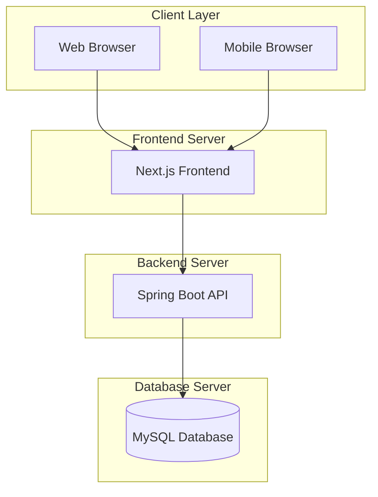
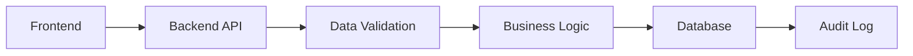
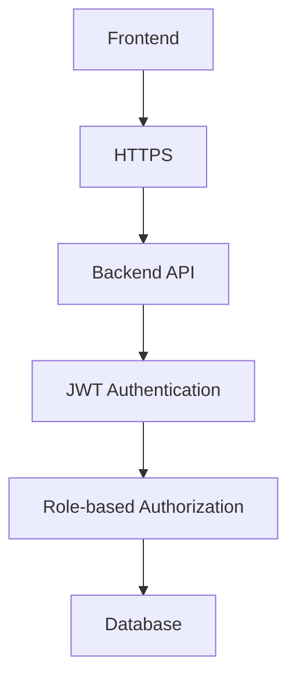
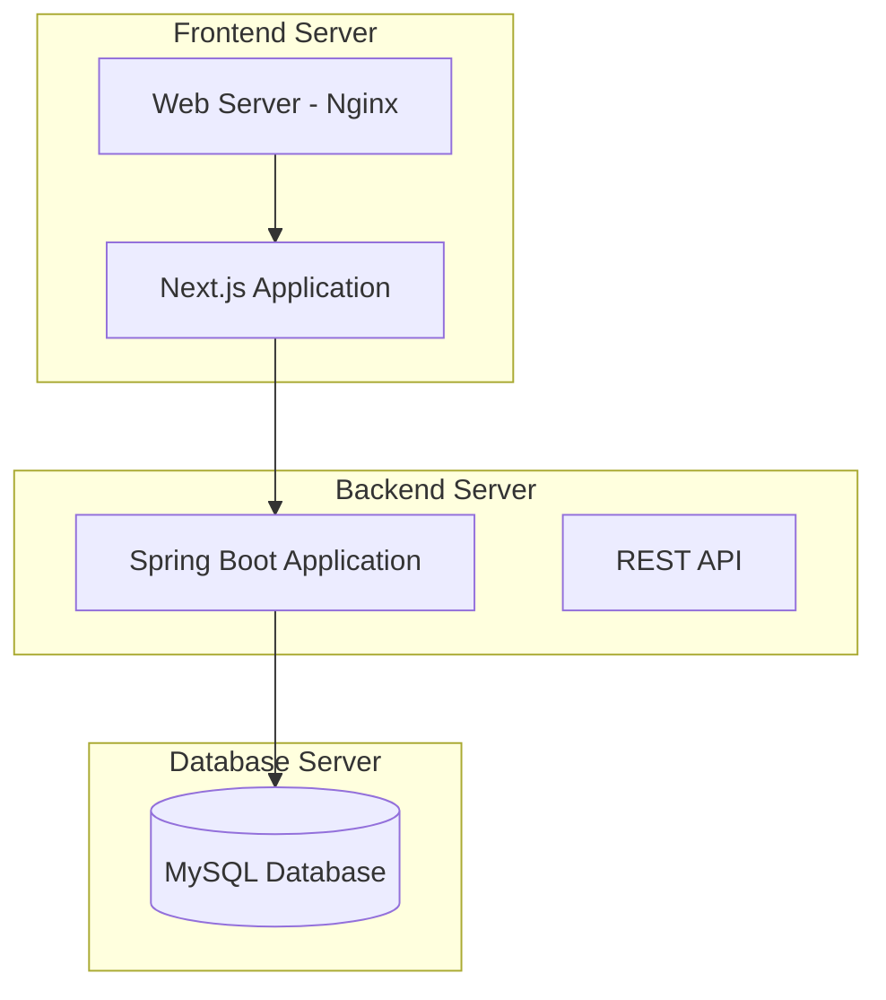

# System Architecture Document
## SkillBridge Platform - Student Project

**Version:** 1.0  
**Date:** December 2024  
**Author:** Student Architecture Team  
**Status:** Draft  
**Project Type:** Student Academic Project  

---

## Table of Contents

1. [Executive Summary](#executive-summary)
2. [Architecture Overview](#architecture-overview)
3. [System Architecture](#system-architecture)
4. [Technology Stack](#technology-stack)
5. [Data Architecture](#data-architecture)
6. [Security Architecture](#security-architecture)
7. [Deployment Architecture](#deployment-architecture)
8. [Development Guidelines](#development-guidelines)
9. [Appendices](#appendices)

---

## Executive Summary

The SkillBridge platform is designed as a simple, monolithic web application for student learning purposes. The architecture focuses on fundamental web development concepts while supporting the basic requirements of offshore IT project management between Japan and Vietnam. This is designed for educational purposes and demonstrates core software engineering principles.

### Key Architectural Principles
- **Monolithic Architecture**: Simple, single-deployment application
- **Student-Friendly**: Technologies suitable for learning
- **Modular Design**: Well-organized code structure for learning
- **RESTful API**: Standard API design patterns
- **Database-First**: Clear data modeling and relationships
- **Learning-Focused**: Emphasis on fundamental concepts

---

## Architecture Overview

### 2.1 High-Level Architecture



### 2.2 Architecture Patterns

#### 2.2.1 Monolithic Architecture
- **Single Deployment**: One application deployment
- **Shared Database**: Single database for all modules
- **Simple Communication**: Direct API calls between frontend and backend
- **Easy Development**: Straightforward development and debugging

#### 2.2.2 MVC Pattern
- **Model**: Database entities and business logic
- **View**: React components for user interface
- **Controller**: Spring Boot REST controllers
- **Separation of Concerns**: Clear separation between layers

#### 2.2.3 RESTful API Design
- **Resource-Based URLs**: Clear API endpoints
- **HTTP Methods**: GET, POST, PUT, DELETE for CRUD operations
- **JSON Communication**: Standard JSON data exchange
- **Stateless**: No server-side session management

---

## System Architecture

### 3.1 Application Modules

#### 3.1.1 Contact Management Module
**Purpose**: Manages the complete contact lifecycle from initial inquiry to opportunity conversion

**Responsibilities**:
- Contact creation and management
- Pipeline stage management
- Activity tracking and logging
- Contact qualification and scoring
- Opportunity conversion

**Key Components**:
- ContactController (REST API)
- ContactService (Business Logic)
- ContactRepository (Data Access)
- Contact Entity (JPA Entity)

**Data Model**:
```sql
CREATE TABLE contacts (
  id INT PRIMARY KEY AUTO_INCREMENT,
  client_id INT NOT NULL,
  sales_rep_id INT NOT NULL,
  status ENUM('NEW', 'IN_PROGRESS', 'VERIFIED', 'CONVERTED', 'CLOSED'),
  priority ENUM('LOW', 'MEDIUM', 'HIGH'),
  source VARCHAR(100),
  created_at TIMESTAMP DEFAULT CURRENT_TIMESTAMP,
  updated_at TIMESTAMP DEFAULT CURRENT_TIMESTAMP ON UPDATE CURRENT_TIMESTAMP
);

CREATE TABLE contact_activities (
  id INT PRIMARY KEY AUTO_INCREMENT,
  contact_id INT NOT NULL,
  activity_type ENUM('CALL', 'EMAIL', 'MEETING', 'NOTE'),
  description TEXT,
  user_id INT NOT NULL,
  created_at TIMESTAMP DEFAULT CURRENT_TIMESTAMP,
  FOREIGN KEY (contact_id) REFERENCES contacts(id)
);
```

#### 3.1.2 Proposal Management Module
**Purpose**: Handles proposal creation, review, and approval workflows

**Responsibilities**:
- Proposal template management
- Dynamic proposal generation
- Review workflow management
- Version control and history
- Client submission and tracking

**Key Components**:
- ProposalController (REST API)
- ProposalService (Business Logic)
- ProposalRepository (Data Access)
- Proposal Entity (JPA Entity)

**Data Model**:
```sql
CREATE TABLE proposals (
  id INT PRIMARY KEY AUTO_INCREMENT,
  contact_id INT NOT NULL,
  template_id INT,
  version INT DEFAULT 1,
  status ENUM('DRAFT', 'REVIEW', 'APPROVED', 'SENT', 'ACCEPTED', 'REJECTED'),
  content TEXT,
  created_by INT NOT NULL,
  created_at TIMESTAMP DEFAULT CURRENT_TIMESTAMP,
  updated_at TIMESTAMP DEFAULT CURRENT_TIMESTAMP ON UPDATE CURRENT_TIMESTAMP,
  FOREIGN KEY (contact_id) REFERENCES contacts(id)
);

CREATE TABLE proposal_reviews (
  id INT PRIMARY KEY AUTO_INCREMENT,
  proposal_id INT NOT NULL,
  reviewer_id INT NOT NULL,
  status ENUM('PENDING', 'APPROVED', 'REJECTED'),
  comments TEXT,
  reviewed_at TIMESTAMP,
  FOREIGN KEY (proposal_id) REFERENCES proposals(id)
);
```

#### 3.1.3 Contract Management Module
**Purpose**: Comprehensive contract lifecycle management including MSA, SOW, and change requests

**Responsibilities**:
- MSA and SOW creation and management
- Change request processing
- Amendment generation
- Contract approval workflows
- Document management

**Key Components**:
- ContractController (REST API)
- ContractService (Business Logic)
- ContractRepository (Data Access)
- Contract Entity (JPA Entity)

**Data Model**:
```sql
CREATE TABLE contracts (
  id INT PRIMARY KEY AUTO_INCREMENT,
  client_id INT NOT NULL,
  contract_type ENUM('MSA', 'SOW'),
  status ENUM('DRAFT', 'REVIEW', 'SENT', 'APPROVED', 'ACTIVE', 'COMPLETED', 'TERMINATED'),
  effective_date DATE,
  expiration_date DATE,
  terms TEXT,
  created_at TIMESTAMP DEFAULT CURRENT_TIMESTAMP,
  updated_at TIMESTAMP DEFAULT CURRENT_TIMESTAMP ON UPDATE CURRENT_TIMESTAMP
);

CREATE TABLE change_requests (
  id INT PRIMARY KEY AUTO_INCREMENT,
  contract_id INT NOT NULL,
  requestor_id INT NOT NULL,
  type ENUM('SCOPE', 'TIMELINE', 'COST', 'RESOURCE'),
  description TEXT,
  impact_analysis TEXT,
  status ENUM('DRAFT', 'REVIEW', 'APPROVED', 'REJECTED'),
  created_at TIMESTAMP DEFAULT CURRENT_TIMESTAMP,
  updated_at TIMESTAMP DEFAULT CURRENT_TIMESTAMP ON UPDATE CURRENT_TIMESTAMP,
  FOREIGN KEY (contract_id) REFERENCES contracts(id)
);
```

#### 3.1.4 Engineer Management Module
**Purpose**: Manages engineer profiles, skills, and availability

**Responsibilities**:
- Engineer profile management
- Skill and certification tracking
- Availability management
- Performance tracking
- Skill matching

**Key Components**:
- EngineerController (REST API)
- EngineerService (Business Logic)
- EngineerRepository (Data Access)
- Engineer Entity (JPA Entity)

**Data Model**:
```sql
CREATE TABLE engineers (
  id INT PRIMARY KEY AUTO_INCREMENT,
  name VARCHAR(255) NOT NULL,
  email VARCHAR(255) UNIQUE NOT NULL,
  phone VARCHAR(20),
  location VARCHAR(100),
  status ENUM('AVAILABLE', 'BUSY', 'UNAVAILABLE'),
  created_at TIMESTAMP DEFAULT CURRENT_TIMESTAMP,
  updated_at TIMESTAMP DEFAULT CURRENT_TIMESTAMP ON UPDATE CURRENT_TIMESTAMP
);

CREATE TABLE engineer_skills (
  id INT PRIMARY KEY AUTO_INCREMENT,
  engineer_id INT NOT NULL,
  skill_id INT NOT NULL,
  proficiency_level INT DEFAULT 1,
  years_experience INT DEFAULT 0,
  last_used DATE,
  verified BOOLEAN DEFAULT FALSE,
  FOREIGN KEY (engineer_id) REFERENCES engineers(id),
  FOREIGN KEY (skill_id) REFERENCES skills(id)
);

CREATE TABLE skills (
  id INT PRIMARY KEY AUTO_INCREMENT,
  name VARCHAR(100) NOT NULL,
  category VARCHAR(50),
  description TEXT
);
```

#### 3.1.5 Search & Matching Module
**Purpose**: Basic search capabilities and engineer matching

**Responsibilities**:
- Multi-criteria search
- Basic matching algorithms
- Search results ranking
- Search history
- Performance optimization

**Key Components**:
- SearchController (REST API)
- SearchService (Business Logic)
- SearchRepository (Data Access)
- Search Entity (JPA Entity)

**Search Implementation**:
```sql
-- Search view for optimized queries
CREATE VIEW engineer_search_view AS
SELECT 
  e.id,
  e.name,
  e.email,
  e.location,
  e.status,
  GROUP_CONCAT(s.name) as skills,
  AVG(es.proficiency_level) as avg_proficiency,
  COUNT(es.skill_id) as skill_count
FROM engineers e
LEFT JOIN engineer_skills es ON e.id = es.engineer_id
LEFT JOIN skills s ON es.skill_id = s.id
GROUP BY e.id, e.name, e.email, e.location, e.status;
```

### 3.2 Support Modules

#### 3.2.1 User Management Module
**Purpose**: Handles user authentication and authorization

**Responsibilities**:
- User registration and login
- Role-based access control
- Password management
- Session management
- User profile management

**Key Components**:
- UserController (REST API)
- UserService (Business Logic)
- UserRepository (Data Access)
- User Entity (JPA Entity)

**Data Model**:
```sql
CREATE TABLE users (
  id INT PRIMARY KEY AUTO_INCREMENT,
  username VARCHAR(50) UNIQUE NOT NULL,
  email VARCHAR(255) UNIQUE NOT NULL,
  password_hash VARCHAR(255) NOT NULL,
  role ENUM('ADMIN', 'SALES_MANAGER', 'SALES_REP', 'CLIENT_USER', 'CLIENT_APPROVER'),
  status ENUM('ACTIVE', 'INACTIVE', 'SUSPENDED'),
  created_at TIMESTAMP DEFAULT CURRENT_TIMESTAMP,
  updated_at TIMESTAMP DEFAULT CURRENT_TIMESTAMP ON UPDATE CURRENT_TIMESTAMP
);

CREATE TABLE clients (
  id INT PRIMARY KEY AUTO_INCREMENT,
  company_name VARCHAR(255) NOT NULL,
  contact_person VARCHAR(255),
  email VARCHAR(255),
  phone VARCHAR(20),
  address TEXT,
  created_at TIMESTAMP DEFAULT CURRENT_TIMESTAMP,
  updated_at TIMESTAMP DEFAULT CURRENT_TIMESTAMP ON UPDATE CURRENT_TIMESTAMP
);
```

#### 3.2.2 File Management Module
**Purpose**: Basic file upload and storage

**Responsibilities**:
- File upload and storage
- File type validation
- Basic access control
- File metadata management

**Key Components**:
- FileController (REST API)
- FileService (Business Logic)
- FileRepository (Data Access)
- File Entity (JPA Entity)

**Data Model**:
```sql
CREATE TABLE files (
  id INT PRIMARY KEY AUTO_INCREMENT,
  filename VARCHAR(255) NOT NULL,
  original_filename VARCHAR(255) NOT NULL,
  file_path VARCHAR(500) NOT NULL,
  file_size BIGINT,
  mime_type VARCHAR(100),
  uploaded_by INT NOT NULL,
  created_at TIMESTAMP DEFAULT CURRENT_TIMESTAMP,
  FOREIGN KEY (uploaded_by) REFERENCES users(id)
);
```

#### 3.2.3 Audit Log Module
**Purpose**: Basic audit trail and logging

**Responsibilities**:
- Activity logging
- Change tracking
- Basic reporting
- Data retention

**Key Components**:
- AuditController (REST API)
- AuditService (Business Logic)
- AuditRepository (Data Access)
- AuditLog Entity (JPA Entity)

**Data Model**:
```sql
CREATE TABLE audit_logs (
  id INT PRIMARY KEY AUTO_INCREMENT,
  table_name VARCHAR(100) NOT NULL,
  record_id INT NOT NULL,
  action VARCHAR(50) NOT NULL,
  old_values TEXT,
  new_values TEXT,
  user_id INT NOT NULL,
  created_at TIMESTAMP DEFAULT CURRENT_TIMESTAMP,
  FOREIGN KEY (user_id) REFERENCES users(id)
);
```

---

## Technology Stack

### 4.1 Backend Technologies

#### 4.1.1 Core Framework
- **Language**: Java 17+
- **Framework**: Spring Boot 3.x
- **Build Tool**: Maven
- **ORM**: Spring Data JPA
- **Database**: MySQL 8.0+
- **Server**: Embedded Tomcat

#### 4.1.2 API & Integration
- **REST API**: Spring Web MVC
- **Validation**: Spring Validation
- **Security**: Spring Security
- **Documentation**: Swagger/OpenAPI 3
- **Testing**: JUnit 5 + Mockito

#### 4.1.3 Security & Authentication
- **Authentication**: JWT tokens
- **Authorization**: Spring Security
- **Password Encoding**: BCrypt
- **CORS**: Spring CORS configuration
- **Input Validation**: Bean Validation

### 4.2 Frontend Technologies

#### 4.2.1 Web Application
- **Framework**: Next.js 14+
- **Language**: TypeScript
- **Styling**: Tailwind CSS
- **UI Components**: Headless UI
- **State Management**: React Context + useReducer
- **HTTP Client**: Axios
- **Build Tool**: Next.js built-in

#### 4.2.2 Development Tools
- **Package Manager**: npm
- **Linting**: ESLint
- **Formatting**: Prettier
- **Testing**: Jest + React Testing Library
- **Type Checking**: TypeScript

### 4.3 Infrastructure Technologies

#### 4.3.1 Development Environment
- **Local Development**: Docker Compose
- **Database**: MySQL Docker container
- **Version Control**: Git
- **IDE**: VS Code or IntelliJ IDEA

#### 4.3.2 Deployment
- **Frontend**: Vercel or Netlify
- **Backend**: Railway or Heroku
- **Database**: PlanetScale or AWS RDS
- **File Storage**: Local filesystem or AWS S3

#### 4.3.3 Monitoring & Logging
- **Application Logs**: Logback
- **Error Tracking**: Sentry (optional)
- **Performance**: Basic Spring Boot Actuator
- **Health Checks**: Spring Boot Actuator endpoints

---

## Data Architecture

### 5.1 Database Design

#### 5.1.1 Primary Database (MySQL)
**Purpose**: Transactional data and ACID compliance

**Complete Database Schema**:
```sql
-- Users and Authentication
CREATE TABLE users (
  id INT PRIMARY KEY AUTO_INCREMENT,
  username VARCHAR(50) UNIQUE NOT NULL,
  email VARCHAR(255) UNIQUE NOT NULL,
  password_hash VARCHAR(255) NOT NULL,
  role ENUM('ADMIN', 'SALES_MANAGER', 'SALES_REP', 'CLIENT_USER'),
  status ENUM('ACTIVE', 'INACTIVE', 'SUSPENDED'),
  created_at TIMESTAMP DEFAULT CURRENT_TIMESTAMP,
  updated_at TIMESTAMP DEFAULT CURRENT_TIMESTAMP ON UPDATE CURRENT_TIMESTAMP
);

-- Clients
CREATE TABLE clients (
  id INT PRIMARY KEY AUTO_INCREMENT,
  company_name VARCHAR(255) NOT NULL,
  contact_person VARCHAR(255),
  email VARCHAR(255),
  phone VARCHAR(20),
  address TEXT,
  created_at TIMESTAMP DEFAULT CURRENT_TIMESTAMP,
  updated_at TIMESTAMP DEFAULT CURRENT_TIMESTAMP ON UPDATE CURRENT_TIMESTAMP
);

-- Contacts
CREATE TABLE contacts (
  id INT PRIMARY KEY AUTO_INCREMENT,
  client_id INT NOT NULL,
  sales_rep_id INT NOT NULL,
  status ENUM('NEW', 'IN_PROGRESS', 'VERIFIED', 'CONVERTED', 'CLOSED'),
  priority ENUM('LOW', 'MEDIUM', 'HIGH'),
  source VARCHAR(100),
  created_at TIMESTAMP DEFAULT CURRENT_TIMESTAMP,
  updated_at TIMESTAMP DEFAULT CURRENT_TIMESTAMP ON UPDATE CURRENT_TIMESTAMP,
  FOREIGN KEY (client_id) REFERENCES clients(id),
  FOREIGN KEY (sales_rep_id) REFERENCES users(id)
);

-- Contact Activities
CREATE TABLE contact_activities (
  id INT PRIMARY KEY AUTO_INCREMENT,
  contact_id INT NOT NULL,
  activity_type ENUM('CALL', 'EMAIL', 'MEETING', 'NOTE'),
  description TEXT,
  user_id INT NOT NULL,
  created_at TIMESTAMP DEFAULT CURRENT_TIMESTAMP,
  FOREIGN KEY (contact_id) REFERENCES contacts(id),
  FOREIGN KEY (user_id) REFERENCES users(id)
);

-- Engineers
CREATE TABLE engineers (
  id INT PRIMARY KEY AUTO_INCREMENT,
  name VARCHAR(255) NOT NULL,
  email VARCHAR(255) UNIQUE NOT NULL,
  phone VARCHAR(20),
  location VARCHAR(100),
  status ENUM('AVAILABLE', 'BUSY', 'UNAVAILABLE'),
  created_at TIMESTAMP DEFAULT CURRENT_TIMESTAMP,
  updated_at TIMESTAMP DEFAULT CURRENT_TIMESTAMP ON UPDATE CURRENT_TIMESTAMP
);

-- Skills
CREATE TABLE skills (
  id INT PRIMARY KEY AUTO_INCREMENT,
  name VARCHAR(100) NOT NULL,
  category VARCHAR(50),
  description TEXT
);

-- Engineer Skills
CREATE TABLE engineer_skills (
  id INT PRIMARY KEY AUTO_INCREMENT,
  engineer_id INT NOT NULL,
  skill_id INT NOT NULL,
  proficiency_level INT DEFAULT 1,
  years_experience INT DEFAULT 0,
  last_used DATE,
  verified BOOLEAN DEFAULT FALSE,
  FOREIGN KEY (engineer_id) REFERENCES engineers(id),
  FOREIGN KEY (skill_id) REFERENCES skills(id)
);

-- Proposals
CREATE TABLE proposals (
  id INT PRIMARY KEY AUTO_INCREMENT,
  contact_id INT NOT NULL,
  template_id INT,
  version INT DEFAULT 1,
  status ENUM('DRAFT', 'REVIEW', 'APPROVED', 'SENT', 'ACCEPTED', 'REJECTED'),
  content TEXT,
  created_by INT NOT NULL,
  created_at TIMESTAMP DEFAULT CURRENT_TIMESTAMP,
  updated_at TIMESTAMP DEFAULT CURRENT_TIMESTAMP ON UPDATE CURRENT_TIMESTAMP,
  FOREIGN KEY (contact_id) REFERENCES contacts(id),
  FOREIGN KEY (created_by) REFERENCES users(id)
);

-- Proposal Reviews
CREATE TABLE proposal_reviews (
  id INT PRIMARY KEY AUTO_INCREMENT,
  proposal_id INT NOT NULL,
  reviewer_id INT NOT NULL,
  status ENUM('PENDING', 'APPROVED', 'REJECTED'),
  comments TEXT,
  reviewed_at TIMESTAMP,
  FOREIGN KEY (proposal_id) REFERENCES proposals(id),
  FOREIGN KEY (reviewer_id) REFERENCES users(id)
);

-- Contracts
CREATE TABLE contracts (
  id INT PRIMARY KEY AUTO_INCREMENT,
  client_id INT NOT NULL,
  contract_type ENUM('MSA', 'SOW'),
  status ENUM('DRAFT', 'REVIEW', 'SENT', 'APPROVED', 'ACTIVE', 'COMPLETED', 'TERMINATED'),
  effective_date DATE,
  expiration_date DATE,
  terms TEXT,
  created_at TIMESTAMP DEFAULT CURRENT_TIMESTAMP,
  updated_at TIMESTAMP DEFAULT CURRENT_TIMESTAMP ON UPDATE CURRENT_TIMESTAMP,
  FOREIGN KEY (client_id) REFERENCES clients(id)
);

-- Change Requests
CREATE TABLE change_requests (
  id INT PRIMARY KEY AUTO_INCREMENT,
  contract_id INT NOT NULL,
  requestor_id INT NOT NULL,
  type ENUM('SCOPE', 'TIMELINE', 'COST', 'RESOURCE'),
  description TEXT,
  impact_analysis TEXT,
  status ENUM('DRAFT', 'REVIEW', 'APPROVED', 'REJECTED'),
  created_at TIMESTAMP DEFAULT CURRENT_TIMESTAMP,
  updated_at TIMESTAMP DEFAULT CURRENT_TIMESTAMP ON UPDATE CURRENT_TIMESTAMP,
  FOREIGN KEY (contract_id) REFERENCES contracts(id),
  FOREIGN KEY (requestor_id) REFERENCES users(id)
);

-- Files
CREATE TABLE files (
  id INT PRIMARY KEY AUTO_INCREMENT,
  filename VARCHAR(255) NOT NULL,
  original_filename VARCHAR(255) NOT NULL,
  file_path VARCHAR(500) NOT NULL,
  file_size BIGINT,
  mime_type VARCHAR(100),
  uploaded_by INT NOT NULL,
  created_at TIMESTAMP DEFAULT CURRENT_TIMESTAMP,
  FOREIGN KEY (uploaded_by) REFERENCES users(id)
);

-- Audit Logs
CREATE TABLE audit_logs (
  id INT PRIMARY KEY AUTO_INCREMENT,
  table_name VARCHAR(100) NOT NULL,
  record_id INT NOT NULL,
  action VARCHAR(50) NOT NULL,
  old_values TEXT,
  new_values TEXT,
  user_id INT NOT NULL,
  created_at TIMESTAMP DEFAULT CURRENT_TIMESTAMP,
  FOREIGN KEY (user_id) REFERENCES users(id)
);
```

#### 5.1.2 Database Indexes
**Purpose**: Optimize query performance

**Key Indexes**:
```sql
-- Performance indexes
CREATE INDEX idx_contacts_status ON contacts(status);
CREATE INDEX idx_contacts_sales_rep ON contacts(sales_rep_id);
CREATE INDEX idx_engineers_status ON engineers(status);
CREATE INDEX idx_engineer_skills_engineer ON engineer_skills(engineer_id);
CREATE INDEX idx_engineer_skills_skill ON engineer_skills(skill_id);
CREATE INDEX idx_proposals_status ON proposals(status);
CREATE INDEX idx_contracts_status ON contracts(status);
CREATE INDEX idx_audit_logs_table_record ON audit_logs(table_name, record_id);
```

#### 5.1.3 Database Views
**Purpose**: Simplify complex queries

**Search View**:
```sql
-- Engineer search view for optimized queries
CREATE VIEW engineer_search_view AS
SELECT 
  e.id,
  e.name,
  e.email,
  e.location,
  e.status,
  GROUP_CONCAT(s.name) as skills,
  AVG(es.proficiency_level) as avg_proficiency,
  COUNT(es.skill_id) as skill_count
FROM engineers e
LEFT JOIN engineer_skills es ON e.id = es.engineer_id
LEFT JOIN skills s ON es.skill_id = s.id
GROUP BY e.id, e.name, e.email, e.location, e.status;
```

### 5.2 Data Flow Architecture

#### 5.2.1 Simple Data Flow


#### 5.2.2 CRUD Operations
- **Create**: Insert new records with validation
- **Read**: Query data with proper indexing
- **Update**: Update records with audit logging
- **Delete**: Soft delete with audit trail

### 5.3 Data Management

#### 5.3.1 Data Validation
- **Input Validation**: Bean validation annotations
- **Business Rules**: Service layer validation
- **Database Constraints**: Foreign key and unique constraints
- **Data Types**: Appropriate MySQL data types

#### 5.3.2 Data Relationships
- **One-to-Many**: Users → Contacts, Clients → Contracts
- **Many-to-Many**: Engineers ↔ Skills
- **Foreign Keys**: Proper referential integrity
- **Cascading**: Appropriate cascade operations

#### 5.3.3 Basic Security
- **Password Hashing**: BCrypt password encoding
- **Input Sanitization**: SQL injection prevention
- **Access Control**: Role-based permissions
- **Audit Trail**: Complete change tracking

---

## Security Architecture

### 6.1 Basic Security Layers

#### 6.1.1 Application Security


**Components**:
- **HTTPS**: Secure communication between frontend and backend
- **JWT Authentication**: Token-based authentication
- **Role-based Authorization**: Spring Security with role-based access
- **Input Validation**: Server-side validation for all inputs

#### 6.1.2 Authentication & Authorization
- **JWT Tokens**: Stateless authentication
- **Password Hashing**: BCrypt password encoding
- **Role-based Access**: Different permissions for different roles
- **Session Management**: Token expiration and refresh
- **CORS Configuration**: Cross-origin resource sharing setup

#### 6.1.3 Data Security
- **Password Encryption**: BCrypt hashing for passwords
- **HTTPS Only**: All communication over HTTPS
- **Input Sanitization**: SQL injection prevention
- **Data Validation**: Bean validation annotations
- **Audit Logging**: Track all data changes

### 6.2 Security Implementation

#### 6.2.1 User Roles and Permissions
```java
// Spring Security Configuration
@Configuration
@EnableWebSecurity
public class SecurityConfig {
    
    @Bean
    public SecurityFilterChain filterChain(HttpSecurity http) throws Exception {
        http
            .authorizeHttpRequests(authz -> authz
                .requestMatchers("/api/auth/**").permitAll()
                .requestMatchers("/api/admin/**").hasRole("ADMIN")
                .requestMatchers("/api/sales/**").hasAnyRole("SALES_MANAGER", "SALES_REP")
                .requestMatchers("/api/client/**").hasAnyRole("CLIENT_USER", "CLIENT_APPROVER")
                .anyRequest().authenticated()
            )
            .jwt(jwt -> jwt.jwtDecoder(jwtDecoder()));
        return http.build();
    }
}
```

#### 6.2.2 Role-based Access Control
```yaml
Roles and Permissions:
  ADMIN:
    - Full system access
    - User management
    - System configuration
  
  SALES_MANAGER:
    - Contact management
    - Proposal approval
    - Contract management
    - Team oversight
  
  SALES_REP:
    - Contact creation
    - Proposal creation
    - Basic reporting
  
  CLIENT_USER:
    - View own contracts
    - Create change requests
    - View project status
  
  CLIENT_APPROVER:
    - Approve contracts
    - Approve change requests
    - View all client data
```

#### 6.2.3 Basic Security Measures
- **Input Validation**: Server-side validation for all inputs
- **SQL Injection Prevention**: Parameterized queries with JPA
- **XSS Protection**: Input sanitization and output encoding
- **CSRF Protection**: Spring Security CSRF protection
- **Error Handling**: Secure error messages without sensitive information

---

## Deployment Architecture

### 7.1 Simple Deployment Architecture

#### 7.1.1 Three-Server Architecture


#### 7.1.2 Server Specifications
```yaml
Frontend Server:
  - CPU: 2 cores
  - RAM: 4GB
  - Storage: 50GB SSD
  - OS: Ubuntu 20.04 LTS
  - Web Server: Nginx
  - Application: Next.js

Backend Server:
  - CPU: 4 cores
  - RAM: 8GB
  - Storage: 100GB SSD
  - OS: Ubuntu 20.04 LTS
  - Runtime: Java 17
  - Application: Spring Boot

Database Server:
  - CPU: 2 cores
  - RAM: 4GB
  - Storage: 200GB SSD
  - OS: Ubuntu 20.04 LTS
  - Database: MySQL 8.0
  - Backup: Daily automated backups
```

### 7.2 Development Environment

#### 7.2.1 Local Development Setup
```yaml
Development Stack:
  Frontend:
    - Node.js 18+
    - Next.js 14+
    - TypeScript
    - Tailwind CSS
  
  Backend:
    - Java 17+
    - Spring Boot 3.x
    - Maven
    - MySQL 8.0
  
  Database:
    - MySQL 8.0
    - MySQL Workbench (GUI)
    - Docker (optional)
```

#### 7.2.2 Docker Development Environment
```yaml
# docker-compose.yml
version: '3.8'
services:
  mysql:
    image: mysql:8.0
    environment:
      MYSQL_ROOT_PASSWORD: rootpassword
      MYSQL_DATABASE: skillbridge
    ports:
      - "3306:3306"
    volumes:
      - mysql_data:/var/lib/mysql

  backend:
    build: ./backend
    ports:
      - "8080:8080"
    depends_on:
      - mysql
    environment:
      SPRING_DATASOURCE_URL: jdbc:mysql://mysql:3306/skillbridge

volumes:
  mysql_data:
```

### 7.3 Production Deployment

#### 7.3.1 Deployment Options
```yaml
Option 1 - Cloud VPS:
  - Provider: DigitalOcean, Linode, or AWS EC2
  - Cost: $50-100/month
  - Setup: Manual server configuration
  - Maintenance: Manual updates

Option 2 - Platform as a Service:
  - Frontend: Vercel or Netlify
  - Backend: Railway or Heroku
  - Database: PlanetScale or AWS RDS
  - Cost: $20-50/month
  - Setup: Automated deployment
  - Maintenance: Managed services
```

#### 7.3.2 Basic Monitoring
```yaml
Monitoring Setup:
  Application:
    - Spring Boot Actuator endpoints
    - Health checks (/actuator/health)
    - Basic metrics (/actuator/metrics)
  
  Database:
    - MySQL slow query log
    - Connection monitoring
    - Disk usage monitoring
  
  Server:
    - CPU and memory usage
    - Disk space monitoring
    - Basic uptime monitoring
```

---

## Development Guidelines

### 8.1 Coding Standards

#### 8.1.1 Backend (Spring Boot) Standards
```java
// Entity Example
@Entity
@Table(name = "contacts")
public class Contact {
    @Id
    @GeneratedValue(strategy = GenerationType.IDENTITY)
    private Integer id;
    
    @Column(name = "client_id", nullable = false)
    private Integer clientId;
    
    @Enumerated(EnumType.STRING)
    private ContactStatus status;
    
    @CreationTimestamp
    private LocalDateTime createdAt;
    
    @UpdateTimestamp
    private LocalDateTime updatedAt;
    
    // Constructors, getters, setters
}

// Controller Example
@RestController
@RequestMapping("/api/contacts")
@Validated
public class ContactController {
    
    @Autowired
    private ContactService contactService;
    
    @GetMapping
    public ResponseEntity<List<Contact>> getAllContacts() {
        List<Contact> contacts = contactService.findAll();
        return ResponseEntity.ok(contacts);
    }
    
    @PostMapping
    public ResponseEntity<Contact> createContact(@Valid @RequestBody Contact contact) {
        Contact savedContact = contactService.save(contact);
        return ResponseEntity.status(HttpStatus.CREATED).body(savedContact);
    }
}
```

#### 8.1.2 Frontend (Next.js) Standards
```typescript
// Component Example
interface Contact {
  id: number;
  clientId: number;
  status: 'NEW' | 'IN_PROGRESS' | 'VERIFIED' | 'CONVERTED' | 'CLOSED';
  priority: 'LOW' | 'MEDIUM' | 'HIGH';
  createdAt: string;
  updatedAt: string;
}

const ContactList: React.FC = () => {
  const [contacts, setContacts] = useState<Contact[]>([]);
  const [loading, setLoading] = useState(true);

  useEffect(() => {
    fetchContacts();
  }, []);

  const fetchContacts = async () => {
    try {
      const response = await api.get('/contacts');
      setContacts(response.data);
    } catch (error) {
      console.error('Error fetching contacts:', error);
    } finally {
      setLoading(false);
    }
  };

  if (loading) return <div>Loading...</div>;

  return (
    <div className="space-y-4">
      {contacts.map(contact => (
        <ContactCard key={contact.id} contact={contact} />
      ))}
    </div>
  );
};
```

### 8.2 Project Structure

#### 8.2.1 Backend Structure
```
backend/
├── src/
│   ├── main/
│   │   ├── java/
│   │   │   └── com/skillbridge/
│   │   │       ├── SkillBridgeApplication.java
│   │   │       ├── config/
│   │   │       │   ├── SecurityConfig.java
│   │   │       │   └── DatabaseConfig.java
│   │   │       ├── controller/
│   │   │       │   ├── ContactController.java
│   │   │       │   ├── EngineerController.java
│   │   │       │   └── ContractController.java
│   │   │       ├── service/
│   │   │       │   ├── ContactService.java
│   │   │       │   ├── EngineerService.java
│   │   │       │   └── ContractService.java
│   │   │       ├── repository/
│   │   │       │   ├── ContactRepository.java
│   │   │       │   ├── EngineerRepository.java
│   │   │       │   └── ContractRepository.java
│   │   │       ├── entity/
│   │   │       │   ├── Contact.java
│   │   │       │   ├── Engineer.java
│   │   │       │   └── Contract.java
│   │   │       └── dto/
│   │   │           ├── ContactDto.java
│   │   │           ├── EngineerDto.java
│   │   │           └── ContractDto.java
│   │   └── resources/
│   │       ├── application.yml
│   │       └── data.sql
│   └── test/
│       └── java/
├── pom.xml
└── README.md
```

#### 8.2.2 Frontend Structure
```
frontend/
├── src/
│   ├── app/
│   │   ├── layout.tsx
│   │   ├── page.tsx
│   │   ├── contacts/
│   │   │   ├── page.tsx
│   │   │   └── [id]/page.tsx
│   │   ├── engineers/
│   │   │   ├── page.tsx
│   │   │   └── [id]/page.tsx
│   │   └── contracts/
│   │       ├── page.tsx
│   │       └── [id]/page.tsx
│   ├── components/
│   │   ├── ui/
│   │   │   ├── Button.tsx
│   │   │   ├── Input.tsx
│   │   │   └── Modal.tsx
│   │   ├── ContactCard.tsx
│   │   ├── EngineerCard.tsx
│   │   └── ContractCard.tsx
│   ├── lib/
│   │   ├── api.ts
│   │   ├── auth.ts
│   │   └── utils.ts
│   ├── types/
│   │   ├── contact.ts
│   │   ├── engineer.ts
│   │   └── contract.ts
│   └── styles/
│       └── globals.css
├── package.json
├── tailwind.config.js
└── README.md
```

### 8.3 Development Workflow

#### 8.3.1 Git Workflow
```bash
# Feature Development
git checkout -b feature/contact-management
# Make changes
git add .
git commit -m "Add contact management functionality"
git push origin feature/contact-management
# Create Pull Request

# Bug Fix
git checkout -b bugfix/fix-contact-validation
# Fix the bug
git add .
git commit -m "Fix contact validation issue"
git push origin bugfix/fix-contact-validation
```

#### 8.3.2 Testing Strategy
```java
// Unit Test Example
@ExtendWith(MockitoExtension.class)
class ContactServiceTest {
    
    @Mock
    private ContactRepository contactRepository;
    
    @InjectMocks
    private ContactService contactService;
    
    @Test
    void shouldCreateContact() {
        // Given
        Contact contact = new Contact();
        contact.setClientId(1);
        contact.setStatus(ContactStatus.NEW);
        
        when(contactRepository.save(any(Contact.class))).thenReturn(contact);
        
        // When
        Contact result = contactService.save(contact);
        
        // Then
        assertThat(result).isNotNull();
        assertThat(result.getStatus()).isEqualTo(ContactStatus.NEW);
        verify(contactRepository).save(contact);
    }
}
```

### 8.4 Performance Guidelines

#### 8.4.1 Database Optimization
```sql
-- Use appropriate indexes
CREATE INDEX idx_contacts_status ON contacts(status);
CREATE INDEX idx_contacts_sales_rep ON contacts(sales_rep_id);

-- Use LIMIT for pagination
SELECT * FROM contacts 
WHERE status = 'NEW' 
ORDER BY created_at DESC 
LIMIT 20 OFFSET 0;

-- Use JOIN instead of multiple queries
SELECT c.*, cl.company_name 
FROM contacts c 
JOIN clients cl ON c.client_id = cl.id;
```

#### 8.4.2 Frontend Optimization
```typescript
// Use React.memo for expensive components
const ContactCard = React.memo(({ contact }: { contact: Contact }) => {
  return (
    <div className="border rounded-lg p-4">
      <h3>{contact.clientName}</h3>
      <p>Status: {contact.status}</p>
    </div>
  );
});

// Use useMemo for expensive calculations
const filteredContacts = useMemo(() => {
  return contacts.filter(contact => contact.status === 'NEW');
}, [contacts]);

// Use useCallback for event handlers
const handleContactUpdate = useCallback((id: number, updates: Partial<Contact>) => {
  // Update logic
}, []);
```

### 8.5 Documentation Standards

#### 8.5.1 API Documentation
```java
@RestController
@RequestMapping("/api/contacts")
@Tag(name = "Contact Management", description = "APIs for managing contacts")
public class ContactController {
    
    @Operation(summary = "Get all contacts", description = "Retrieve all contacts with pagination")
    @ApiResponses(value = {
        @ApiResponse(responseCode = "200", description = "Successfully retrieved contacts"),
        @ApiResponse(responseCode = "401", description = "Unauthorized")
    })
    @GetMapping
    public ResponseEntity<List<Contact>> getAllContacts(
        @Parameter(description = "Page number") @RequestParam(defaultValue = "0") int page,
        @Parameter(description = "Page size") @RequestParam(defaultValue = "20") int size
    ) {
        // Implementation
    }
}
```

#### 8.5.2 Code Documentation
```java
/**
 * Service class for managing contacts
 * Handles business logic for contact operations including CRUD operations
 * and contact lifecycle management
 */
@Service
@Transactional
public class ContactService {
    
    /**
     * Creates a new contact
     * @param contact the contact to create
     * @return the created contact with generated ID
     * @throws ValidationException if contact data is invalid
     */
    public Contact createContact(Contact contact) {
        // Implementation
    }
}
```

---

## Appendices

### Appendix A: Technology Decision Matrix

| Technology | Category | Justification | Alternatives |
|------------|----------|---------------|--------------|
| Java/Spring Boot | Backend | Mature framework, good for learning | Node.js, Python Flask |
| Next.js/React | Frontend | Modern React framework, good DX | Vue.js, Angular |
| MySQL | Database | Relational database, easy to learn | PostgreSQL, SQLite |
| TypeScript | Language | Type safety, better development experience | JavaScript |
| Tailwind CSS | Styling | Utility-first, rapid development | Bootstrap, Material-UI |

### Appendix B: Database Schema Summary

#### B.1 Core Tables
```sql
-- Main business entities
users (id, username, email, password_hash, role, status)
clients (id, company_name, contact_person, email, phone, address)
contacts (id, client_id, sales_rep_id, status, priority, source)
engineers (id, name, email, phone, location, status)
skills (id, name, category, description)
engineer_skills (id, engineer_id, skill_id, proficiency_level, years_experience)
proposals (id, contact_id, template_id, version, status, content, created_by)
contracts (id, client_id, contract_type, status, effective_date, expiration_date, terms)
change_requests (id, contract_id, requestor_id, type, description, impact_analysis, status)
files (id, filename, original_filename, file_path, file_size, mime_type, uploaded_by)
audit_logs (id, table_name, record_id, action, old_values, new_values, user_id)
```

#### B.2 Relationships
- Users → Contacts (One-to-Many)
- Clients → Contacts (One-to-Many)
- Clients → Contracts (One-to-Many)
- Engineers ↔ Skills (Many-to-Many)
- Contacts → Proposals (One-to-Many)
- Contracts → Change Requests (One-to-Many)

### Appendix C: API Endpoints Summary

#### C.1 Contact Management
```
GET    /api/contacts              - Get all contacts
GET    /api/contacts/{id}        - Get contact by ID
POST   /api/contacts             - Create new contact
PUT    /api/contacts/{id}        - Update contact
DELETE /api/contacts/{id}        - Delete contact
GET    /api/contacts/{id}/activities - Get contact activities
POST   /api/contacts/{id}/activities - Add activity
```

#### C.2 Engineer Management
```
GET    /api/engineers            - Get all engineers
GET    /api/engineers/{id}       - Get engineer by ID
POST   /api/engineers            - Create new engineer
PUT    /api/engineers/{id}       - Update engineer
DELETE /api/engineers/{id}       - Delete engineer
GET    /api/engineers/search     - Search engineers
GET    /api/engineers/{id}/skills - Get engineer skills
POST   /api/engineers/{id}/skills - Add skill to engineer
```

#### C.3 Contract Management
```
GET    /api/contracts            - Get all contracts
GET    /api/contracts/{id}       - Get contract by ID
POST   /api/contracts            - Create new contract
PUT    /api/contracts/{id}        - Update contract
GET    /api/contracts/{id}/change-requests - Get change requests
POST   /api/contracts/{id}/change-requests - Create change request
```

### Appendix D: Development Setup Guide

#### D.1 Prerequisites
```bash
# Required software
- Java 17+
- Node.js 18+
- MySQL 8.0+
- Git
- IDE (VS Code or IntelliJ IDEA)
```

#### D.2 Backend Setup
```bash
# Clone repository
git clone <repository-url>
cd skillbridge-backend

# Install dependencies
mvn clean install

# Configure database
# Update application.yml with database connection

# Run application
mvn spring-boot:run
```

#### D.3 Frontend Setup
```bash
# Navigate to frontend directory
cd skillbridge-frontend

# Install dependencies
npm install

# Configure environment
# Update .env.local with API URL

# Run development server
npm run dev
```

#### D.4 Database Setup
```sql
-- Create database
CREATE DATABASE skillbridge;

-- Run schema script
source schema.sql;

-- Insert sample data
source sample-data.sql;
```

---

**Document Control**
- **Version**: 1.0
- **Last Updated**: December 2024
- **Next Review**: March 2025
- **Approved By**: Student Architecture Team
- **Distribution**: Development Team, Instructors, Students
