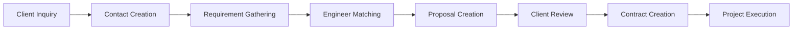
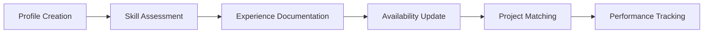
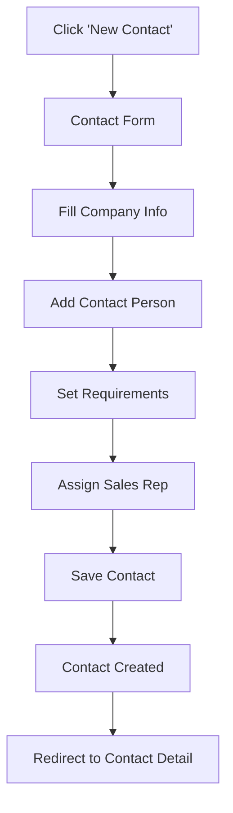
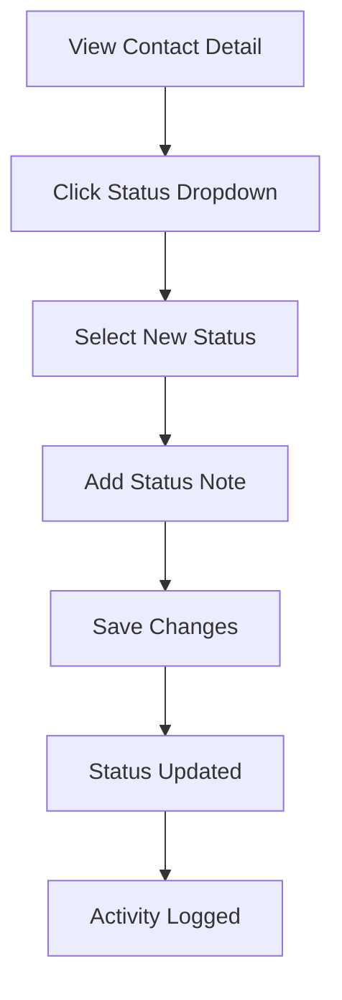
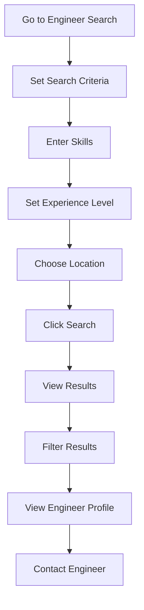
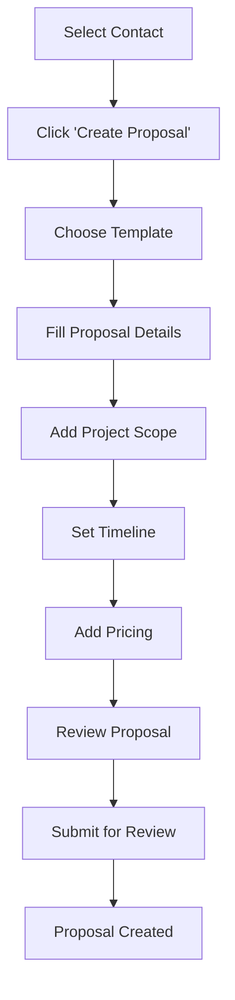

# Frontend Specification Document
## SkillBridge Platform - User Experience & Interface Design

**Version:** 1.0  
**Date:** December 2024  
**Author:** UX Design Team  
**Status:** Draft  
**Project Type:** Student Academic Project  

---

## Table of Contents

1. [Executive Summary](#executive-summary)
2. [User Research & Personas](#user-research--personas)
3. [Design System](#design-system)
4. [Information Architecture](#information-architecture)
5. [Wireframes & Mockups](#wireframes--mockups)
6. [Component Library](#component-library)
7. [Responsive Design](#responsive-design)
8. [Accessibility Guidelines](#accessibility-guidelines)
9. [User Flows](#user-flows)
10. [Performance Requirements](#performance-requirements)
11. [Implementation Guidelines](#implementation-guidelines)
12. [Appendices](#appendices)

---

## Executive Summary

The SkillBridge frontend is designed as a modern, intuitive web application that serves multiple user types in the offshore IT project management ecosystem. The design emphasizes simplicity, efficiency, and professional aesthetics while maintaining student-friendly implementation complexity.

### Key Design Principles
- **User-Centric**: Designed around actual user needs and workflows
- **Professional**: Clean, modern interface suitable for business use
- **Accessible**: WCAG 2.1 AA compliance for inclusive design
- **Responsive**: Seamless experience across all devices
- **Intuitive**: Clear navigation and logical information hierarchy
- **Efficient**: Streamlined workflows for common tasks

---

## User Research & Personas

### 2.1 Primary User Personas

#### 2.1.1 Sales Representative - "Sarah"
**Demographics:**
- Age: 28-35
- Role: Front-line sales representative
- Experience: 2-5 years in sales
- Tech Comfort: Intermediate

**Goals:**
- Quickly manage client contacts and pipeline
- Create professional proposals efficiently
- Track sales activities and progress
- Convert contacts to opportunities

**Pain Points:**
- Manual proposal creation takes too long
- Difficulty tracking contact history
- Lack of visibility into client preferences
- Time-consuming data entry

**Needs:**
- Quick contact creation and management
- Template-based proposal generation
- Activity tracking and reminders
- Client communication history

#### 2.1.2 Sales Manager - "Michael"
**Demographics:**
- Age: 35-45
- Role: Sales team manager
- Experience: 5+ years in management
- Tech Comfort: Intermediate

**Goals:**
- Oversee team performance and pipeline
- Review and approve proposals
- Monitor sales metrics and KPIs
- Ensure quality and compliance

**Pain Points:**
- Difficulty tracking team performance
- Manual approval processes
- Lack of real-time visibility
- Inconsistent proposal quality

**Needs:**
- Dashboard with key metrics
- Streamlined approval workflows
- Team performance insights
- Quality control tools

#### 2.1.3 Client User - "Mr. Tanaka"
**Demographics:**
- Age: 40-55
- Role: IT Manager at Japanese company
- Experience: 10+ years in IT management
- Tech Comfort: Basic to Intermediate

**Goals:**
- Find suitable engineers for projects
- Review and approve contracts
- Track project progress
- Manage change requests

**Pain Points:**
- Language barriers in communication
- Lack of transparency in process
- Difficulty understanding technical requirements
- Time zone differences

**Needs:**
- Clear project visibility
- Easy contract review
- Simple change request process
- Multilingual support

#### 2.1.4 Engineer - "Nguyen"
**Demographics:**
- Age: 25-35
- Role: Software Engineer
- Experience: 2-8 years in development
- Tech Comfort: Advanced

**Goals:**
- Maintain professional profile
- Showcase skills and experience
- Find suitable projects
- Track project history

**Pain Points:**
- Difficulty updating profile information
- Limited visibility into available projects
- Complex skill categorization
- Time-consuming profile maintenance

**Needs:**
- Easy profile management
- Skill showcase tools
- Project matching
- Performance tracking

### 2.2 User Journey Mapping

#### 2.2.1 Contact-to-Contract Journey


#### 2.2.2 Engineer Profile Journey


---

## Design System

### 3.1 Brand Identity

#### 3.1.1 Color Palette

##### Client Portal (Blue Theme)
```css
/* Primary Blue Colors */
--blue-50: #eff6ff;
--blue-100: #dbeafe;
--blue-200: #bfdbfe;
--blue-300: #93c5fd;
--blue-400: #60a5fa;
--blue-500: #3b82f6;    /* Main blue */
--blue-600: #2563eb;    /* Darker blue */
--blue-700: #1d4ed8;    /* Dark blue */
--blue-800: #1e40af;
--blue-900: #1e3a8a;

/* Blue Gradients */
--blue-gradient-light: #3366ff;
--blue-gradient-dark: #0033cc;
--blue-gradient: linear-gradient(135deg, #3366ff 0%, #0033cc 100%);

/* Client Portal Specific */
--client-primary: #3366ff;
--client-secondary: #6699ff;
--client-accent: #2a52be;
--client-dark: #0033cc;
```

##### Admin/Sales (Orange/Grey Theme)
```css
/* Orange Accent Colors */
--orange-50: #fff7ed;
--orange-100: #ffedd5;
--orange-200: #fed7aa;
--orange-300: #fdba74;
--orange-400: #fb923c;
--orange-500: #f97316;    /* Main orange */
--orange-600: #ea580c;    /* Darker orange */
--orange-700: #c2410c;
--orange-800: #9a3412;
--orange-900: #7c2d12;

/* Grey Scale */
--grey-50: #f9fafb;
--grey-100: #f3f4f6;
--grey-200: #e5e7eb;
--grey-300: #d1d5db;
--grey-400: #9ca3af;
--grey-500: #6b7280;
--grey-600: #4b5563;
--grey-700: #374151;
--grey-800: #1f2937;
--grey-900: #111827;

/* Admin/Sales Specific */
--admin-primary: #ff8c00;        /* Orange accent */
--admin-secondary: #4299e1;      /* Blue for links */
--admin-sidebar: #28303e;        /* Dark sidebar */
--admin-sidebar-active: #364152; /* Active sidebar item */
--admin-bg: #ffffff;            /* White background */
--admin-text: #2d3748;           /* Dark grey text */
--admin-text-light: #a0aec0;     /* Light grey text */
--admin-border: #e2e8f0;         /* Light grey border */
--admin-table-header: #f7fafc;   /* Very light grey */

/* Status Colors */
--success: #9ae6b4;              /* Light green */
--warning: #f59e0b;
--error: #e53e3e;                 /* Red for notifications */
--info: #4299e1;                  /* Blue for info */
```

#### 3.1.3 Theme Usage Guidelines

##### Client Portal (Blue Theme)
```css
/* Usage for Client Portal */
.client-hero {
  background: var(--blue-gradient);
  color: white;
}

.client-card {
  background: var(--client-accent);
  color: white;
  border-radius: 0.5rem;
}

.client-button {
  background: var(--client-secondary);
  color: white;
  border: none;
  border-radius: 0.25rem;
}

.client-text {
  color: white;
}

.client-logo {
  color: var(--client-secondary);
}
```

##### Admin/Sales (Orange/Grey Theme)
```css
/* Usage for Admin/Sales */
.admin-sidebar {
  background: var(--admin-sidebar);
  color: var(--admin-text-light);
}

.admin-sidebar-active {
  background: var(--admin-sidebar-active);
  color: white;
}

.admin-button-primary {
  background: var(--admin-primary);
  color: white;
  border: none;
  border-radius: 0.25rem;
}

.admin-link {
  color: var(--admin-secondary);
  text-decoration: none;
}

.admin-table {
  background: var(--admin-bg);
  color: var(--admin-text);
}

.admin-table-header {
  background: var(--admin-table-header);
  color: var(--admin-text);
}

.admin-notification {
  background: var(--error);
  color: white;
  border-radius: 50%;
}
```

#### 3.1.2 Typography
```css
/* Font Families */
--font-primary: 'Inter', -apple-system, BlinkMacSystemFont, sans-serif;
--font-mono: 'JetBrains Mono', 'Fira Code', monospace;

/* Font Sizes */
--text-xs: 0.75rem;    /* 12px */
--text-sm: 0.875rem;    /* 14px */
--text-base: 1rem;      /* 16px */
--text-lg: 1.125rem;    /* 18px */
--text-xl: 1.25rem;     /* 20px */
--text-2xl: 1.5rem;     /* 24px */
--text-3xl: 1.875rem;   /* 30px */
--text-4xl: 2.25rem;    /* 36px */

/* Font Weights */
--font-light: 300;
--font-normal: 400;
--font-medium: 500;
--font-semibold: 600;
--font-bold: 700;

/* Theme-specific Typography */
/* Client Portal */
--client-title: 2.5rem;     /* Large hero title */
--client-subtitle: 1.25rem; /* Hero subtitle */
--client-card-title: 1.125rem; /* Card titles */

/* Admin/Sales */
--admin-sidebar-text: 0.875rem; /* Sidebar navigation */
--admin-table-text: 0.875rem;   /* Table content */
--admin-header-text: 1rem;      /* Page headers */
```

#### 3.1.3 Spacing System
```css
/* Spacing Scale (8px base) */
--space-1: 0.25rem;   /* 4px */
--space-2: 0.5rem;    /* 8px */
--space-3: 0.75rem;   /* 12px */
--space-4: 1rem;      /* 16px */
--space-5: 1.25rem;   /* 20px */
--space-6: 1.5rem;    /* 24px */
--space-8: 2rem;      /* 32px */
--space-10: 2.5rem;   /* 40px */
--space-12: 3rem;     /* 48px */
--space-16: 4rem;     /* 64px */
--space-20: 5rem;     /* 80px */
--space-24: 6rem;     /* 96px */
```

#### 3.1.4 Border Radius
```css
--radius-sm: 0.125rem;   /* 2px */
--radius-base: 0.25rem;  /* 4px */
--radius-md: 0.375rem;   /* 6px */
--radius-lg: 0.5rem;     /* 8px */
--radius-xl: 0.75rem;    /* 12px */
--radius-2xl: 1rem;      /* 16px */
--radius-full: 9999px;
```

#### 3.1.5 Shadows
```css
--shadow-sm: 0 1px 2px 0 rgb(0 0 0 / 0.05);
--shadow-base: 0 1px 3px 0 rgb(0 0 0 / 0.1), 0 1px 2px -1px rgb(0 0 0 / 0.1);
--shadow-md: 0 4px 6px -1px rgb(0 0 0 / 0.1), 0 2px 4px -2px rgb(0 0 0 / 0.1);
--shadow-lg: 0 10px 15px -3px rgb(0 0 0 / 0.1), 0 4px 6px -4px rgb(0 0 0 / 0.1);
--shadow-xl: 0 20px 25px -5px rgb(0 0 0 / 0.1), 0 8px 10px -6px rgb(0 0 0 / 0.1);
```

### 3.2 Design Tokens

#### 3.2.1 Component Tokens
```css
/* Button Tokens */
--btn-height-sm: 2rem;
--btn-height-base: 2.5rem;
--btn-height-lg: 3rem;
--btn-padding-x: 1rem;
--btn-padding-y: 0.5rem;

/* Input Tokens */
--input-height: 2.5rem;
--input-padding-x: 0.75rem;
--input-padding-y: 0.5rem;
--input-border-width: 1px;

/* Card Tokens */
--card-padding: 1.5rem;
--card-border-width: 1px;
--card-border-radius: 0.5rem;
```

---

## Information Architecture

### 4.1 Site Structure

#### 4.1.1 Main Navigation
```
SkillBridge Platform
├── Dashboard
├── Contacts
│   ├── All Contacts
│   ├── New Contact
│   └── Contact Pipeline
├── Engineers
│   ├── All Engineers
│   ├── Add Engineer
│   ├── Skills Management
│   └── Search & Match
├── Proposals
│   ├── All Proposals
│   ├── Create Proposal
│   └── Templates
├── Contracts
│   ├── All Contracts
│   ├── Create Contract
│   ├── Change Requests
│   └── Amendments
├── Reports
│   ├── Sales Analytics
│   ├── Performance Metrics
│   └── Custom Reports
└── Settings
    ├── User Management
    ├── System Configuration
    └── Master Data
```

#### 4.1.2 User-Specific Navigation

**Sales Representative Navigation:**
- Dashboard
- My Contacts
- My Proposals
- Engineer Search
- Activity Log

**Sales Manager Navigation:**
- Team Dashboard
- All Contacts
- Proposal Reviews
- Team Performance
- Reports

**Client User Navigation:**
- Project Dashboard
- My Contracts
- Change Requests
- Engineer Profiles
- Notifications

**Engineer Navigation:**
- Profile Dashboard
- My Skills
- Project History
- Availability
- Performance

### 4.2 Page Hierarchy

#### 4.2.1 Primary Pages
1. **Dashboard** - Central hub for each user type
2. **Contacts** - Contact management and pipeline
3. **Engineers** - Engineer profiles and search
4. **Proposals** - Proposal creation and management
5. **Contracts** - Contract lifecycle management
6. **Reports** - Analytics and insights

#### 4.2.2 Secondary Pages
1. **Profile Settings** - User profile management
2. **Notifications** - System notifications
3. **Help & Support** - Documentation and support
4. **Admin Panel** - System administration

---

## Wireframes & Mockups

### 5.1 Dashboard Wireframes

#### 5.1.1 Sales Representative Dashboard (Admin/Sales Theme)
```
┌─────────────────────────────────────────────────────────────┐
│ SkillBridge Platform                    [🔔] [User] [Settings] │
├─────────────────────────────────────────────────────────────┤
│ [Dashboard] [Contacts] [Engineers] [Proposals] [Contracts] │
├─────────────────────────────────────────────────────────────┤
│                                                             │
│  ┌─────────────┐ ┌─────────────┐ ┌─────────────┐           │
│  │ My Contacts │ │ My Pipeline │ │ Recent      │           │
│  │     12      │ │     8       │ │ Activities  │           │
│  └─────────────┘ └─────────────┘ └─────────────┘           │
│                                                             │
│  ┌─────────────────────────────────────────────────────────┐ │
│  │ Recent Contacts                                        │ │
│  │ ┌─────┐ Company Name        Status    Priority  Actions │ │
│  │ │ [A] │ ABC Corp            New       High     [View]  │ │
│  │ │ [B] │ XYZ Ltd             Progress   Medium   [View]  │ │
│  │ │ [C] │ Tech Solutions      Verified   Low      [View]  │ │
│  └─────────────────────────────────────────────────────────┘ │
│                                                             │
│  ┌─────────────────────────────────────────────────────────┐ │
│  │ Quick Actions                                          │ │
│  │ [🟠 New Contact] [🔍 Search Engineers] [📄 Create Proposal] │ │
│  └─────────────────────────────────────────────────────────┘ │
└─────────────────────────────────────────────────────────────┘

Color Scheme:
- Background: White (#ffffff)
- Text: Dark grey (#2d3748)
- Orange buttons: #ff8c00
- Blue links: #4299e1
- Light grey borders: #e2e8f0
```

#### 5.1.2 Client User Dashboard (Client Portal Theme)
```
┌─────────────────────────────────────────────────────────────┐
│ SKILL BRIDGE_                    [🔵 Login] [User] [Settings] │
├─────────────────────────────────────────────────────────────┤
│ [Dashboard] [My Projects] [Engineers] [Contracts] [Help]  │
├─────────────────────────────────────────────────────────────┤
│                                                             │
│  ┌─────────────────────────────────────────────────────────┐ │
│  │                    SKILL BRIDGE                        │ │
│  │        日本とベトナムを結ぶ架け橋、オフショア開発プラットフォーム    │ │
│  └─────────────────────────────────────────────────────────┘ │
│                                                             │
│  ┌─────────────┐ ┌─────────────┐ ┌─────────────┐           │
│  │ Active      │ │ Pending     │ │ Completed   │           │
│  │ Projects    │ │ Approvals   │ │ Projects    │           │
│  │     3       │ │     2       │ │     5       │           │
│  └─────────────┘ └─────────────┘ └─────────────┘           │
│                                                             │
│  ┌─────────────────────────────────────────────────────────┐ │
│  │ My Active Projects                                     │ │
│  │ ┌─────┐ Project Name        Status    Progress Actions│ │
│  │ │ [A] │ E-commerce Site     Active    75%     [View]  │ │
│  │ │ [B] │ Mobile App          Active    45%     [View]  │ │
│  │ │ [C] │ API Development     Active    90%     [View]  │ │
│  └─────────────────────────────────────────────────────────┘ │
│                                                             │
│  ┌─────────────────────────────────────────────────────────┐ │
│  │ Pending Actions                                        │ │
│  │ • Contract approval for Project D                      │ │
│  │ • Change request review for Project A                  │ │
│  └─────────────────────────────────────────────────────────┘ │
└─────────────────────────────────────────────────────────────┘

Color Scheme:
- Hero background: Blue gradient (#3366ff to #0033cc)
- Text: White
- Cards background: Dark blue (#2a52be)
- Button: Light blue (#6699ff)
- Logo: Light blue (#6699ff)
```

### 5.2 Contact Management Wireframes

#### 5.2.1 Contact List View
```
┌─────────────────────────────────────────────────────────────┐
│ Contacts                                    [+ New Contact]│
├─────────────────────────────────────────────────────────────┤
│ [All] [New] [In Progress] [Verified] [Converted] [Closed]   │
├─────────────────────────────────────────────────────────────┤
│ Search: [________________] Filter: [Status ▼] [Sort ▼]     │
├─────────────────────────────────────────────────────────────┤
│                                                             │
│ ┌─────┐ Company Name        Contact Person  Status  Actions│
│ │ [A] │ ABC Corporation     John Smith      New     [View] │
│ │ [B] │ XYZ Solutions       Jane Doe        Progress[View] │
│ │ [C] │ Tech Innovations     Bob Johnson     Verified[View] │
│ │ [D] │ Global Systems      Alice Brown     New     [View] │
│ │ [E] │ Future Tech         Charlie Wilson  Progress[View] │
│                                                             │
│ [< Previous] Page 1 of 5 [Next >]                          │
└─────────────────────────────────────────────────────────────┘
```

#### 5.2.2 Contact Detail View
```
┌─────────────────────────────────────────────────────────────┐
│ ← Back to Contacts                    [Edit] [Convert] [Close]│
├─────────────────────────────────────────────────────────────┤
│                                                             │
│ ABC Corporation                                            │
│ John Smith - john@abc.com - +81-3-1234-5678                │
│                                                             │
│ ┌─────────────────────────────────────────────────────────┐ │
│ │ Contact Information                                    │ │
│ │ Company: ABC Corporation                               │ │
│ │ Industry: Technology                                   │ │
│ │ Size: 100-500 employees                                │ │
│ │ Location: Tokyo, Japan                                 │ │
│ └─────────────────────────────────────────────────────────┘ │
│                                                             │
│ ┌─────────────────────────────────────────────────────────┐ │
│ │ Project Requirements                                   │ │
│ │ • E-commerce website development                        │ │
│ │ • React/Node.js technology stack                        │ │
│ │ • 3-month timeline                                      │ │
│ │ • Budget: $50,000 - $100,000                           │ │
│ └─────────────────────────────────────────────────────────┘ │
│                                                             │
│ ┌─────────────────────────────────────────────────────────┐ │
│ │ Activity Timeline                                       │ │
│ │ 2024-12-15: Initial contact via website                │ │
│ │ 2024-12-16: Phone call - requirements discussion        │ │
│ │ 2024-12-17: Email follow-up sent                        │ │
│ └─────────────────────────────────────────────────────────┘ │
└─────────────────────────────────────────────────────────────┘
```

### 5.3 Engineer Search Wireframes

#### 5.3.1 Engineer Search Interface
```
┌─────────────────────────────────────────────────────────────┐
│ Engineer Search                                            │
├─────────────────────────────────────────────────────────────┤
│                                                             │
│ ┌─────────────────────────────────────────────────────────────┐ │
│ │ Search Criteria                                         │ │
│ │ Skills: [React ▼] [Node.js ▼] [+ Add Skill]            │ │
│ │ Experience: [2-5 years ▼]                             │ │
│ │ Location: [Ho Chi Minh ▼]                               │ │
│ │ Availability: [Available ▼]                            │ │
│ │ [Search] [Clear]                                         │ │
│ └─────────────────────────────────────────────────────────────┘ │
│                                                             │
│ ┌─────────────────────────────────────────────────────────────┐ │
│ │ Search Results (12 engineers found)                      │ │
│ │                                                           │ │
│ │ ┌─────┐ Nguyen Van A        React, Node.js   Available   │ │
│ │ │ [A] │ 5 years experience  Ho Chi Minh      [View Profile]│ │
│ │ └─────┘ Rating: 4.8/5       $3,000/month                │ │
│ │                                                           │ │
│ │ ┌─────┐ Tran Thi B          React, Vue.js    Available   │ │
│ │ │ [B] │ 3 years experience  Hanoi            [View Profile]│ │
│ │ └─────┘ Rating: 4.6/5       $2,500/month                │ │
│ │                                                           │ │
│ │ ┌─────┐ Le Van C            Node.js, Python  Busy        │ │
│ │ │ [C] │ 7 years experience  Da Nang         [View Profile]│ │
│ │ └─────┘ Rating: 4.9/5       $4,000/month                │ │
│ └─────────────────────────────────────────────────────────────┘ │
└─────────────────────────────────────────────────────────────┘
```

---

## Component Library

### 6.1 Core Components

#### 6.1.1 Button Component
```typescript
interface ButtonProps {
  variant: 'primary' | 'secondary' | 'outline' | 'ghost';
  size: 'sm' | 'md' | 'lg';
  disabled?: boolean;
  loading?: boolean;
  children: React.ReactNode;
  onClick?: () => void;
}

// Usage Examples
<Button variant="primary" size="md">Save Contact</Button>
<Button variant="outline" size="sm">Cancel</Button>
<Button variant="ghost" size="lg" loading>Processing...</Button>
```

#### 6.1.2 Input Component
```typescript
interface InputProps {
  type: 'text' | 'email' | 'password' | 'number' | 'tel';
  label?: string;
  placeholder?: string;
  error?: string;
  required?: boolean;
  disabled?: boolean;
  value: string;
  onChange: (value: string) => void;
}

// Usage Examples
<Input 
  type="text" 
  label="Company Name" 
  placeholder="Enter company name"
  value={companyName}
  onChange={setCompanyName}
/>
```

#### 6.1.3 Card Component
```typescript
interface CardProps {
  title?: string;
  subtitle?: string;
  children: React.ReactNode;
  actions?: React.ReactNode;
  variant?: 'default' | 'outlined' | 'elevated';
}

// Usage Examples
<Card title="Contact Information" variant="outlined">
  <p>Company details and contact information</p>
</Card>
```

#### 6.1.4 Table Component
```typescript
interface TableProps<T> {
  data: T[];
  columns: Column<T>[];
  onRowClick?: (row: T) => void;
  loading?: boolean;
  pagination?: PaginationProps;
}

interface Column<T> {
  key: string;
  title: string;
  render: (value: any, row: T) => React.ReactNode;
  sortable?: boolean;
  width?: string;
}
```

#### 6.1.5 Modal Component
```typescript
interface ModalProps {
  isOpen: boolean;
  onClose: () => void;
  title?: string;
  children: React.ReactNode;
  size?: 'sm' | 'md' | 'lg' | 'xl';
  closable?: boolean;
}

// Usage Examples
<Modal 
  isOpen={isModalOpen} 
  onClose={() => setIsModalOpen(false)}
  title="Create New Contact"
  size="lg"
>
  <ContactForm />
</Modal>
```

### 6.2 Form Components

#### 6.2.1 Form Field Component
```typescript
interface FormFieldProps {
  label: string;
  required?: boolean;
  error?: string;
  children: React.ReactNode;
  helpText?: string;
}

// Usage Examples
<FormField label="Email Address" required error={emailError}>
  <Input type="email" value={email} onChange={setEmail} />
</FormField>
```

#### 6.2.2 Select Component
```typescript
interface SelectProps {
  options: Option[];
  value: string;
  onChange: (value: string) => void;
  placeholder?: string;
  searchable?: boolean;
  multiple?: boolean;
}

interface Option {
  value: string;
  label: string;
  disabled?: boolean;
}
```

#### 6.2.3 DatePicker Component
```typescript
interface DatePickerProps {
  value: Date | null;
  onChange: (date: Date | null) => void;
  placeholder?: string;
  minDate?: Date;
  maxDate?: Date;
  disabled?: boolean;
}
```

### 6.3 Layout Components

#### 6.3.1 Page Layout
```typescript
interface PageLayoutProps {
  title: string;
  subtitle?: string;
  actions?: React.ReactNode;
  children: React.ReactNode;
  breadcrumbs?: Breadcrumb[];
}

// Usage Examples
<PageLayout 
  title="Contacts" 
  subtitle="Manage your client contacts"
  actions={<Button>New Contact</Button>}
>
  <ContactList />
</PageLayout>
```

#### 6.3.2 Sidebar Navigation
```typescript
interface SidebarProps {
  items: NavigationItem[];
  activeItem?: string;
  onItemClick: (item: string) => void;
  collapsed?: boolean;
}

interface NavigationItem {
  id: string;
  label: string;
  icon: React.ReactNode;
  href?: string;
  children?: NavigationItem[];
}
```

### 6.4 Data Display Components

#### 6.4.1 Status Badge
```typescript
interface StatusBadgeProps {
  status: 'new' | 'in-progress' | 'verified' | 'converted' | 'closed';
  size?: 'sm' | 'md' | 'lg';
}

// Usage Examples
<StatusBadge status="new" size="md" />
<StatusBadge status="in-progress" size="sm" />
```

#### 6.4.2 Progress Bar
```typescript
interface ProgressBarProps {
  value: number;
  max?: number;
  size?: 'sm' | 'md' | 'lg';
  color?: 'primary' | 'success' | 'warning' | 'error';
  showLabel?: boolean;
}
```

#### 6.4.3 Avatar Component
```typescript
interface AvatarProps {
  src?: string;
  name?: string;
  size?: 'sm' | 'md' | 'lg' | 'xl';
  fallback?: string;
}
```

---

## Responsive Design

### 7.1 Breakpoint System

#### 7.1.1 Breakpoint Definitions
```css
/* Mobile First Approach */
--breakpoint-sm: 640px;   /* Small devices */
--breakpoint-md: 768px;   /* Medium devices */
--breakpoint-lg: 1024px;  /* Large devices */
--breakpoint-xl: 1280px;  /* Extra large devices */
--breakpoint-2xl: 1536px; /* 2X large devices */
```

#### 7.1.2 Container Sizes
```css
--container-sm: 640px;
--container-md: 768px;
--container-lg: 1024px;
--container-xl: 1280px;
--container-2xl: 1536px;
```

### 7.2 Mobile Design Patterns

#### 7.2.1 Mobile Navigation
- **Bottom Navigation**: Primary actions at bottom
- **Hamburger Menu**: Secondary navigation in drawer
- **Tab Navigation**: Main sections in tabs
- **Floating Action Button**: Primary action floating

#### 7.2.2 Mobile Forms
- **Single Column Layout**: All form fields in single column
- **Large Touch Targets**: Minimum 44px touch targets
- **Simplified Inputs**: Reduce input complexity
- **Progressive Disclosure**: Show/hide fields as needed

#### 7.2.3 Mobile Tables
- **Card Layout**: Convert table rows to cards
- **Horizontal Scroll**: Allow horizontal scrolling
- **Collapsible Rows**: Expandable row details
- **Action Sheets**: Bottom sheet for actions

### 7.3 Tablet Design Patterns

#### 7.3.1 Tablet Navigation
- **Sidebar Navigation**: Collapsible sidebar
- **Tab Navigation**: Main sections in tabs
- **Breadcrumb Navigation**: Show current location
- **Floating Action Button**: Primary actions

#### 7.3.2 Tablet Layouts
- **Two Column Layout**: Sidebar + main content
- **Grid Layout**: Card-based grid system
- **Split View**: Master-detail pattern
- **Modal Overlay**: Full-screen modals

### 7.4 Desktop Design Patterns

#### 7.4.1 Desktop Navigation
- **Top Navigation**: Horizontal navigation bar
- **Sidebar Navigation**: Persistent sidebar
- **Breadcrumb Navigation**: Hierarchical navigation
- **Contextual Actions**: Right-click menus

#### 7.4.2 Desktop Layouts
- **Multi-Column Layout**: Complex grid systems
- **Dashboard Layout**: Widget-based dashboard
- **Split Pane**: Multiple content areas
- **Floating Panels**: Overlay panels

---

## Accessibility Guidelines

### 8.1 WCAG 2.1 AA Compliance

#### 8.1.1 Color Contrast
- **Normal Text**: Minimum 4.5:1 contrast ratio
- **Large Text**: Minimum 3:1 contrast ratio
- **UI Components**: Minimum 3:1 contrast ratio
- **Focus Indicators**: Minimum 3:1 contrast ratio

#### 8.1.2 Keyboard Navigation
- **Tab Order**: Logical tab sequence
- **Focus Indicators**: Visible focus states
- **Skip Links**: Skip to main content
- **Keyboard Shortcuts**: Common shortcuts

#### 8.1.3 Screen Reader Support
- **Semantic HTML**: Proper HTML structure
- **ARIA Labels**: Descriptive labels
- **Live Regions**: Dynamic content updates
- **Alternative Text**: Image descriptions

### 8.2 Accessibility Features

#### 8.2.1 Visual Accessibility
- **High Contrast Mode**: Alternative color schemes
- **Font Size Controls**: User-adjustable text size
- **Color Blind Support**: Color-independent design
- **Motion Reduction**: Respect prefers-reduced-motion

#### 8.2.2 Motor Accessibility
- **Large Touch Targets**: Minimum 44px targets
- **Drag and Drop**: Alternative interaction methods
- **Voice Control**: Voice command support
- **Switch Navigation**: Alternative input methods

#### 8.2.3 Cognitive Accessibility
- **Clear Language**: Simple, clear text
- **Consistent Navigation**: Predictable interface
- **Error Prevention**: Clear error messages
- **Help and Support**: Contextual help

---

## User Flows

### 9.1 Contact Management Flow

#### 9.1.1 Create New Contact


#### 9.1.2 Update Contact Status


### 9.2 Engineer Search Flow

#### 9.2.1 Search for Engineers


### 9.3 Proposal Creation Flow

#### 9.3.1 Create Proposal


---

## Performance Requirements

### 10.1 Loading Performance

#### 10.1.1 Core Web Vitals
- **Largest Contentful Paint (LCP)**: < 2.5 seconds
- **First Input Delay (FID)**: < 100 milliseconds
- **Cumulative Layout Shift (CLS)**: < 0.1

#### 10.1.2 Page Load Times
- **Initial Page Load**: < 3 seconds
- **Subsequent Page Loads**: < 1 second
- **API Response Times**: < 500 milliseconds
- **Image Load Times**: < 2 seconds

### 10.2 Optimization Strategies

#### 10.2.1 Code Splitting
- **Route-based Splitting**: Split by page routes
- **Component Splitting**: Lazy load heavy components
- **Library Splitting**: Separate vendor bundles
- **Dynamic Imports**: Load components on demand

#### 10.2.2 Image Optimization
- **WebP Format**: Modern image format
- **Responsive Images**: Multiple sizes
- **Lazy Loading**: Load images on scroll
- **Compression**: Optimize file sizes

#### 10.2.3 Caching Strategy
- **Browser Caching**: Static asset caching
- **API Caching**: Response caching
- **Service Worker**: Offline functionality
- **CDN**: Global content delivery

---

## Implementation Guidelines

### 11.1 Theme Implementation

#### 11.1.1 Theme Configuration
```typescript
// Theme configuration
export const themes = {
  client: {
    name: 'Client Portal',
    colors: {
      primary: '#3366ff',
      secondary: '#6699ff',
      accent: '#2a52be',
      dark: '#0033cc',
      background: 'linear-gradient(135deg, #3366ff 0%, #0033cc 100%)',
      text: '#ffffff',
      card: '#2a52be',
    },
    typography: {
      title: '2.5rem',
      subtitle: '1.25rem',
      cardTitle: '1.125rem',
    }
  },
  admin: {
    name: 'Admin/Sales',
    colors: {
      primary: '#ff8c00',
      secondary: '#4299e1',
      sidebar: '#28303e',
      sidebarActive: '#364152',
      background: '#ffffff',
      text: '#2d3748',
      textLight: '#a0aec0',
      border: '#e2e8f0',
      tableHeader: '#f7fafc',
    },
    typography: {
      sidebar: '0.875rem',
      table: '0.875rem',
      header: '1rem',
    }
  }
};
```

#### 11.1.2 Theme Provider
```typescript
// Theme context
interface ThemeContextType {
  theme: 'client' | 'admin';
  setTheme: (theme: 'client' | 'admin') => void;
  colors: ThemeColors;
  typography: ThemeTypography;
}

export const ThemeProvider: React.FC<{ children: React.ReactNode }> = ({ children }) => {
  const [theme, setTheme] = useState<'client' | 'admin'>('client');
  
  const contextValue: ThemeContextType = {
    theme,
    setTheme,
    colors: themes[theme].colors,
    typography: themes[theme].typography,
  };

  return (
    <ThemeContext.Provider value={contextValue}>
      {children}
    </ThemeContext.Provider>
  );
};
```

#### 11.1.3 Theme-aware Components
```typescript
// Theme-aware button component
interface ThemedButtonProps {
  variant: 'primary' | 'secondary';
  children: React.ReactNode;
  onClick?: () => void;
}

export const ThemedButton: React.FC<ThemedButtonProps> = ({ variant, children, onClick }) => {
  const { theme, colors } = useTheme();
  
  const getButtonStyles = () => {
    if (theme === 'client') {
      return {
        background: variant === 'primary' ? colors.secondary : colors.accent,
        color: colors.text,
        border: 'none',
        borderRadius: '0.25rem',
      };
    } else {
      return {
        background: variant === 'primary' ? colors.primary : colors.secondary,
        color: '#ffffff',
        border: 'none',
        borderRadius: '0.25rem',
      };
    }
  };

  return (
    <button style={getButtonStyles()} onClick={onClick}>
      {children}
    </button>
  );
};
```

### 11.2 Development Setup

#### 11.2.1 Project Structure
```
src/
├── app/                    # Next.js app directory
│   ├── layout.tsx         # Root layout
│   ├── page.tsx           # Home page
│   ├── contacts/          # Contact pages
│   ├── engineers/         # Engineer pages
│   ├── proposals/         # Proposal pages
│   └── contracts/         # Contract pages
├── components/            # Reusable components
│   ├── ui/               # Base UI components
│   ├── forms/            # Form components
│   ├── layout/           # Layout components
│   └── features/         # Feature components
├── lib/                   # Utility functions
│   ├── api.ts            # API client
│   ├── auth.ts           # Authentication
│   └── utils.ts          # Helper functions
├── types/                 # TypeScript types
├── styles/                # Global styles
└── hooks/                 # Custom React hooks
```

#### 11.1.2 Component Organization
```typescript
// Component file structure
components/
├── ContactCard/
│   ├── index.tsx          # Main component
│   ├── ContactCard.module.css
│   ├── ContactCard.test.tsx
│   └── types.ts
├── ContactForm/
│   ├── index.tsx
│   ├── ContactForm.module.css
│   ├── ContactForm.test.tsx
│   └── types.ts
```

### 11.2 State Management

#### 11.2.1 React Context
```typescript
// Auth Context
interface AuthContextType {
  user: User | null;
  login: (credentials: LoginCredentials) => Promise<void>;
  logout: () => void;
  isLoading: boolean;
}

// Contact Context
interface ContactContextType {
  contacts: Contact[];
  selectedContact: Contact | null;
  createContact: (contact: CreateContactData) => Promise<void>;
  updateContact: (id: string, updates: UpdateContactData) => Promise<void>;
  deleteContact: (id: string) => Promise<void>;
}
```

#### 11.2.2 Custom Hooks
```typescript
// useContacts hook
export const useContacts = () => {
  const [contacts, setContacts] = useState<Contact[]>([]);
  const [loading, setLoading] = useState(false);
  const [error, setError] = useState<string | null>(null);

  const fetchContacts = useCallback(async () => {
    setLoading(true);
    try {
      const data = await api.getContacts();
      setContacts(data);
    } catch (err) {
      setError(err.message);
    } finally {
      setLoading(false);
    }
  }, []);

  return { contacts, loading, error, fetchContacts };
};
```

### 11.3 API Integration

#### 11.3.1 API Client
```typescript
// API client configuration
const apiClient = axios.create({
  baseURL: process.env.NEXT_PUBLIC_API_URL,
  timeout: 10000,
  headers: {
    'Content-Type': 'application/json',
  },
});

// Request interceptor for auth
apiClient.interceptors.request.use((config) => {
  const token = getAuthToken();
  if (token) {
    config.headers.Authorization = `Bearer ${token}`;
  }
  return config;
});
```

#### 11.3.2 API Hooks
```typescript
// useAPI hook for data fetching
export const useAPI = <T>(url: string, options?: RequestOptions) => {
  const [data, setData] = useState<T | null>(null);
  const [loading, setLoading] = useState(false);
  const [error, setError] = useState<string | null>(null);

  const execute = useCallback(async () => {
    setLoading(true);
    setError(null);
    try {
      const response = await apiClient.get<T>(url);
      setData(response.data);
    } catch (err) {
      setError(err.message);
    } finally {
      setLoading(false);
    }
  }, [url]);

  return { data, loading, error, execute };
};
```

### 11.4 Testing Strategy

#### 11.4.1 Unit Testing
```typescript
// Component testing example
import { render, screen, fireEvent } from '@testing-library/react';
import { ContactCard } from './ContactCard';

describe('ContactCard', () => {
  const mockContact = {
    id: '1',
    companyName: 'ABC Corp',
    contactPerson: 'John Smith',
    status: 'new',
  };

  it('renders contact information', () => {
    render(<ContactCard contact={mockContact} />);
    expect(screen.getByText('ABC Corp')).toBeInTheDocument();
    expect(screen.getByText('John Smith')).toBeInTheDocument();
  });

  it('calls onEdit when edit button is clicked', () => {
    const onEdit = jest.fn();
    render(<ContactCard contact={mockContact} onEdit={onEdit} />);
    fireEvent.click(screen.getByText('Edit'));
    expect(onEdit).toHaveBeenCalledWith(mockContact.id);
  });
});
```

#### 11.4.2 Integration Testing
```typescript
// API integration testing
describe('Contact API', () => {
  it('fetches contacts successfully', async () => {
    const mockContacts = [
      { id: '1', companyName: 'ABC Corp' },
      { id: '2', companyName: 'XYZ Ltd' },
    ];

    jest.spyOn(api, 'getContacts').mockResolvedValue(mockContacts);

    const { result } = renderHook(() => useContacts());
    await act(async () => {
      await result.current.fetchContacts();
    });

    expect(result.current.contacts).toEqual(mockContacts);
    expect(result.current.loading).toBe(false);
  });
});
```

---

## Appendices

### Appendix A: Theme Implementation Examples

#### A.1 CSS Implementation
```css
/* Client Portal Styles */
.client-portal {
  --primary: #3366ff;
  --secondary: #6699ff;
  --accent: #2a52be;
  --dark: #0033cc;
  --text: #ffffff;
  --background: linear-gradient(135deg, #3366ff 0%, #0033cc 100%);
}

.client-hero {
  background: var(--background);
  color: var(--text);
  padding: 4rem 2rem;
  text-align: center;
}

.client-card {
  background: var(--accent);
  color: var(--text);
  border-radius: 0.5rem;
  padding: 1.5rem;
  margin: 1rem 0;
}

.client-button {
  background: var(--secondary);
  color: var(--text);
  border: none;
  border-radius: 0.25rem;
  padding: 0.75rem 1.5rem;
  font-weight: 500;
}

/* Admin/Sales Styles */
.admin-portal {
  --primary: #ff8c00;
  --secondary: #4299e1;
  --sidebar: #28303e;
  --sidebar-active: #364152;
  --background: #ffffff;
  --text: #2d3748;
  --text-light: #a0aec0;
  --border: #e2e8f0;
  --table-header: #f7fafc;
}

.admin-sidebar {
  background: var(--sidebar);
  color: var(--text-light);
  padding: 1rem;
  min-height: 100vh;
}

.admin-sidebar-active {
  background: var(--sidebar-active);
  color: var(--text);
}

.admin-button-primary {
  background: var(--primary);
  color: #ffffff;
  border: none;
  border-radius: 0.25rem;
  padding: 0.75rem 1.5rem;
  font-weight: 500;
}

.admin-table {
  background: var(--background);
  color: var(--text);
  border: 1px solid var(--border);
}

.admin-table-header {
  background: var(--table-header);
  color: var(--text);
  font-weight: 600;
}
```

#### A.2 Tailwind CSS Configuration
```javascript
// tailwind.config.js
module.exports = {
  theme: {
    extend: {
      colors: {
        // Client Portal Colors
        'client-primary': '#3366ff',
        'client-secondary': '#6699ff',
        'client-accent': '#2a52be',
        'client-dark': '#0033cc',
        
        // Admin/Sales Colors
        'admin-primary': '#ff8c00',
        'admin-secondary': '#4299e1',
        'admin-sidebar': '#28303e',
        'admin-sidebar-active': '#364152',
        'admin-text': '#2d3748',
        'admin-text-light': '#a0aec0',
        'admin-border': '#e2e8f0',
        'admin-table-header': '#f7fafc',
      },
      backgroundImage: {
        'client-gradient': 'linear-gradient(135deg, #3366ff 0%, #0033cc 100%)',
      }
    }
  }
}
```

#### A.3 Usage Examples
```jsx
// Client Portal Component
const ClientHero = () => (
  <div className="bg-client-gradient text-white py-16 text-center">
    <h1 className="text-4xl font-bold mb-4">SKILL BRIDGE</h1>
    <p className="text-xl">日本とベトナムを結ぶ架け橋、オフショア開発プラットフォーム</p>
    <button className="bg-client-secondary text-white px-6 py-3 rounded mt-4">
      Login
    </button>
  </div>
);

// Admin/Sales Component
const AdminSidebar = () => (
  <div className="bg-admin-sidebar text-admin-text-light min-h-screen p-4">
    <nav>
      <div className="bg-admin-sidebar-active text-white p-2 rounded mb-2">
        Dashboard
      </div>
      <div className="p-2 hover:bg-admin-sidebar-active hover:text-white rounded">
        Contacts
      </div>
    </nav>
  </div>
);
```

### Appendix B: Design Assets

#### B.1 Icon Library
```typescript
// Icon components
export const Icons = {
  // Navigation
  Dashboard: () => <svg>...</svg>,
  Contacts: () => <svg>...</svg>,
  Engineers: () => <svg>...</svg>,
  Proposals: () => <svg>...</svg>,
  Contracts: () => <svg>...</svg>,
  
  // Actions
  Add: () => <svg>...</svg>,
  Edit: () => <svg>...</svg>,
  Delete: () => <svg>...</svg>,
  Search: () => <svg>...</svg>,
  Filter: () => <svg>...</svg>,
  
  // Status
  New: () => <svg>...</svg>,
  InProgress: () => <svg>...</svg>,
  Completed: () => <svg>...</svg>,
  Pending: () => <svg>...</svg>,
};
```

#### A.2 Illustration Library
```typescript
// Illustration components
export const Illustrations = {
  EmptyState: () => <svg>...</svg>,
  ErrorState: () => <svg>...</svg>,
  LoadingState: () => <svg>...</svg>,
  SuccessState: () => <svg>...</svg>,
};
```

### Appendix B: Accessibility Checklist

#### B.1 Visual Accessibility
- [ ] Color contrast meets WCAG AA standards
- [ ] Text is readable at 200% zoom
- [ ] Color is not the only way to convey information
- [ ] Focus indicators are visible
- [ ] High contrast mode is supported

#### B.2 Keyboard Accessibility
- [ ] All interactive elements are keyboard accessible
- [ ] Tab order is logical and intuitive
- [ ] Skip links are provided
- [ ] Keyboard shortcuts are documented
- [ ] Focus management is proper

#### B.3 Screen Reader Accessibility
- [ ] Semantic HTML is used correctly
- [ ] ARIA labels are descriptive
- [ ] Alternative text is provided for images
- [ ] Form labels are associated correctly
- [ ] Live regions are used for dynamic content

### Appendix C: Performance Checklist

#### C.1 Loading Performance
- [ ] Core Web Vitals meet targets
- [ ] Images are optimized
- [ ] Code is split appropriately
- [ ] Caching is implemented
- [ ] CDN is configured

#### C.2 Runtime Performance
- [ ] Components are memoized where needed
- [ ] Unnecessary re-renders are prevented
- [ ] Large lists are virtualized
- [ ] Animations are smooth
- [ ] Memory leaks are prevented

### Appendix D: Browser Support

#### D.1 Supported Browsers
- **Chrome**: Latest 2 versions
- **Firefox**: Latest 2 versions
- **Safari**: Latest 2 versions
- **Edge**: Latest 2 versions

#### D.2 Mobile Browsers
- **iOS Safari**: iOS 14+
- **Chrome Mobile**: Latest 2 versions
- **Samsung Internet**: Latest 2 versions

#### D.3 Progressive Enhancement
- **Core Functionality**: Works without JavaScript
- **Enhanced Experience**: JavaScript enabled
- **Offline Support**: Service worker implementation
- **Fallbacks**: Graceful degradation

---

**Document Control**
- **Version**: 1.0
- **Last Updated**: December 2024
- **Next Review**: March 2025
- **Approved By**: UX Design Team
- **Distribution**: Development Team, Design Team, Product Team
