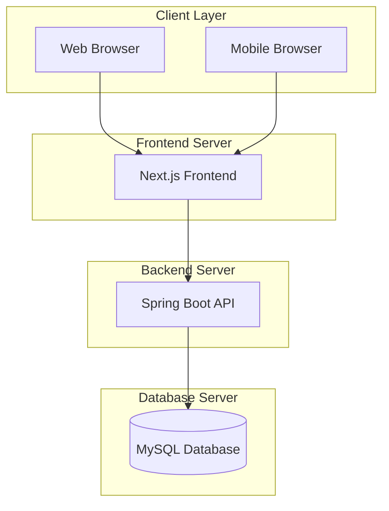

# Architecture Overview

## High-Level Architecture

## Architecture Patterns

### Monolithic Architecture
- **Single Deployment**: One application deployment
- **Shared Database**: Single database for all modules
- **Simple Communication**: Direct API calls between frontend and backend
- **Easy Development**: Straightforward development and debugging

### MVC Pattern
- **Model**: Database entities and business logic
- **View**: React components for user interface
- **Controller**: Spring Boot REST controllers
- **Separation of Concerns**: Clear separation between layers

### RESTful API Design
- **Resource-Based URLs**: Clear API endpoints
- **HTTP Methods**: GET, POST, PUT, DELETE for CRUD operations
- **JSON Communication**: Standard JSON data exchange
- **Stateless**: No server-side session management
