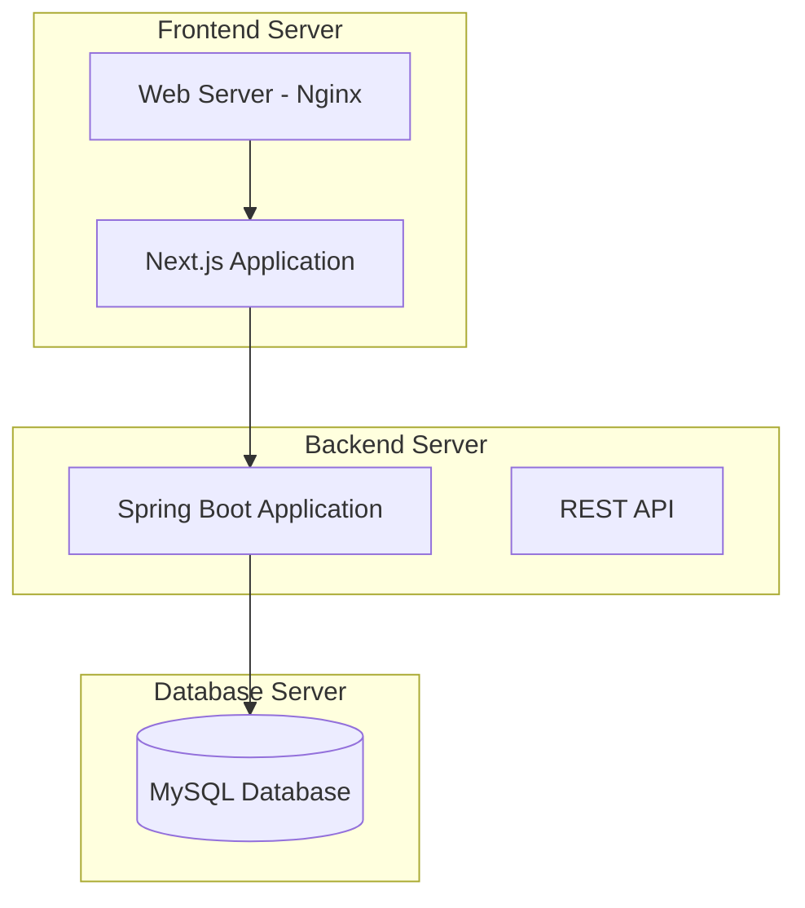

# Deployment Architecture

## Simple Deployment Architecture

### Three-Server Architecture


### Server Specifications
```yaml
Frontend Server:
  - CPU: 2 cores
  - RAM: 4GB
  - Storage: 50GB SSD
  - OS: Ubuntu 20.04 LTS
  - Web Server: Nginx
  - Application: Next.js

Backend Server:
  - CPU: 4 cores
  - RAM: 8GB
  - Storage: 100GB SSD
  - OS: Ubuntu 20.04 LTS
  - Runtime: Java 17
  - Application: Spring Boot

Database Server:
  - CPU: 2 cores
  - RAM: 4GB
  - Storage: 200GB SSD
  - OS: Ubuntu 20.04 LTS
  - Database: MySQL 8.0
  - Backup: Daily automated backups
```

## Development Environment

### Local Development Setup
```yaml
Development Stack:
  Frontend:
    - Node.js 18+
    - Next.js 14+
    - TypeScript
    - Tailwind CSS
  
  Backend:
    - Java 17+
    - Spring Boot 3.x
    - Maven
    - MySQL 8.0
  
  Database:
    - MySQL 8.0
    - MySQL Workbench (GUI)
    - Docker (optional)
```

### Docker Development Environment
```yaml
# docker-compose.yml
version: '3.8'
services:
  mysql:
    image: mysql:8.0
    environment:
      MYSQL_ROOT_PASSWORD: rootpassword
      MYSQL_DATABASE: skillbridge
    ports:
      - "3306:3306"
    volumes:
      - mysql_data:/var/lib/mysql

  backend:
    build: ./backend
    ports:
      - "8080:8080"
    depends_on:
      - mysql
    environment:
      SPRING_DATASOURCE_URL: jdbc:mysql://mysql:3306/skillbridge

volumes:
  mysql_data:
```

## Production Deployment

### Deployment Options
```yaml
Option 1 - Cloud VPS:
  - Provider: DigitalOcean, Linode, or AWS EC2
  - Cost: $50-100/month
  - Setup: Manual server configuration
  - Maintenance: Manual updates

Option 2 - Platform as a Service:
  - Frontend: Vercel or Netlify
  - Backend: Railway or Heroku
  - Database: PlanetScale or AWS RDS
  - Cost: $20-50/month
  - Setup: Automated deployment
  - Maintenance: Managed services
```

### Basic Monitoring
```yaml
Monitoring Setup:
  Application:
    - Spring Boot Actuator endpoints
    - Health checks (/actuator/health)
    - Basic metrics (/actuator/metrics)
  
  Database:
    - MySQL slow query log
    - Connection monitoring
    - Disk usage monitoring
  
  Server:
    - CPU and memory usage
    - Disk space monitoring
    - Basic uptime monitoring
```
