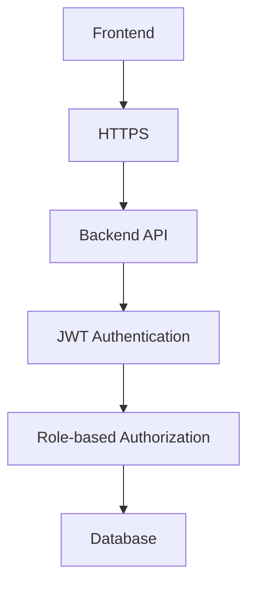

# Security Architecture

## Basic Security Layers

### Application Security


**Components**:
- **HTTPS**: Secure communication between frontend and backend
- **JWT Authentication**: Token-based authentication
- **Role-based Authorization**: Spring Security with role-based access
- **Input Validation**: Server-side validation for all inputs

### Authentication & Authorization
- **JWT Tokens**: Stateless authentication
- **Password Hashing**: BCrypt password encoding
- **Role-based Access**: Different permissions for different roles
- **Session Management**: Token expiration and refresh
- **CORS Configuration**: Cross-origin resource sharing setup

### Data Security
- **Password Encryption**: BCrypt hashing for passwords
- **HTTPS Only**: All communication over HTTPS
- **Input Sanitization**: SQL injection prevention
- **Data Validation**: Bean validation annotations
- **Audit Logging**: Track all data changes

## Security Implementation

### User Roles and Permissions
```java
// Spring Security Configuration
@Configuration
@EnableWebSecurity
public class SecurityConfig {
    
    @Bean
    public SecurityFilterChain filterChain(HttpSecurity http) throws Exception {
        http
            .authorizeHttpRequests(authz -> authz
                .requestMatchers("/api/auth/**").permitAll()
                .requestMatchers("/api/admin/**").hasRole("ADMIN")
                .requestMatchers("/api/sales/**").hasAnyRole("SALES_MANAGER", "SALES_REP")
                .requestMatchers("/api/client/**").hasAnyRole("CLIENT_USER", "CLIENT_APPROVER")
                .anyRequest().authenticated()
            )
            .jwt(jwt -> jwt.jwtDecoder(jwtDecoder()));
        return http.build();
    }
}
```

### Role-based Access Control
```yaml
Roles and Permissions:
  ADMIN:
    - Full system access
    - User management
    - System configuration
  
  SALES_MANAGER:
    - Contact management
    - Proposal approval
    - Contract management
    - Team oversight
  
  SALES_REP:
    - Contact creation
    - Proposal creation
    - Basic reporting
  
  CLIENT_USER:
    - View own contracts
    - Create change requests
    - View project status
  
  CLIENT_APPROVER:
    - Approve contracts
    - Approve change requests
    - View all client data
```

### Basic Security Measures
- **Input Validation**: Server-side validation for all inputs
- **SQL Injection Prevention**: Parameterized queries with JPA
- **XSS Protection**: Input sanitization and output encoding
- **CSRF Protection**: Spring Security CSRF protection
- **Error Handling**: Secure error messages without sensitive information
