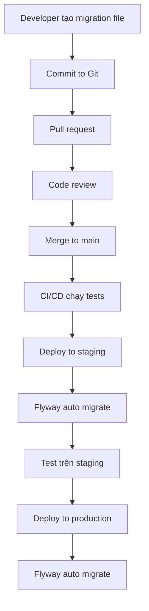

# Flyway Database Migration Guide

## Tổng Quan

SkillBridge Platform sử dụng **Flyway** để quản lý database migrations một cách chuyên nghiệp và tự động.

## Tại Sao Sử Dụng Flyway?

✅ **Version Control cho Database**: Theo dõi mọi thay đổi database như code  
✅ **Tự Động Migration**: Tự động chạy migrations khi khởi động ứng dụng  
✅ **Rollback an toàn**: Dễ dàng quay lại version trước  
✅ **Team Collaboration**: Nhiều developers có thể làm việc cùng lúc  
✅ **CI/CD Integration**: Tích hợp dễ dàng với pipeline deployment  

---

## Cấu Trúc Thư Mục

```
backend/src/main/resources/db/migration/
├── V1__create_tables.sql          # Tạo tables
├── V2__insert_skills.sql          # Insert skills
├── V3__insert_sample_engineers.sql # Insert sample data
└── V{version}__{description}.sql  # Future migrations
```

---

## Naming Convention

Flyway sử dụng naming convention sau:

```
V{VERSION}__{DESCRIPTION}.sql
```

### Ví dụ:
- `V1__create_tables.sql` - Version 1: Tạo tables
- `V2__insert_skills.sql` - Version 2: Insert skills
- `V3__insert_sample_engineers.sql` - Version 3: Insert sample engineers
- `V4__add_user_table.sql` - Version 4: Thêm user table (future)

### Quy Tắc:
- ✅ Prefix: `V` (viết hoa)
- ✅ Version: Số nguyên (1, 2, 3, ...)
- ✅ Separator: `__` (hai dấu gạch dưới)
- ✅ Description: Mô tả ngắn gọn (dùng dấu _ thay space)
- ✅ Extension: `.sql`

---

## Migrations Hiện Tại

### V1: Create Tables
**File**: `V1__create_tables.sql`

Tạo các tables chính:
- `engineers` - Thông tin engineers
- `skills` - Danh sách skills
- `engineer_skills` - Liên kết engineers và skills
- `contacts` - Thông tin khách hàng
- Indexes cho performance

### V2: Insert Skills
**File**: `V2__insert_skills.sql`

Insert initial skills data:
- Web Development skills (React, Vue.js, Node.js, ...)
- Game Development skills (Unity, Unreal Engine, ...)
- AI/ML Development skills (Machine Learning, Deep Learning, ...)

### V3: Insert Sample Engineers
**File**: `V3__insert_sample_engineers.sql`

Insert 9 sample engineers:
- 3 Web developers
- 3 Game developers
- 3 AI/ML engineers
- Engineer skills mapping
- Sample contacts

---

## Cấu Hình Flyway

### application.yml (Production)
```yaml
spring:
  jpa:
    hibernate:
      ddl-auto: validate  # Flyway quản lý schema, không dùng Hibernate
  
  flyway:
    enabled: true
    baseline-on-migrate: true
    validate-on-migrate: true
    clean-disabled: true  # Bảo vệ production database
    locations: classpath:db/migration
```

### application-dev.yml (Development)
```yaml
spring:
  flyway:
    enabled: true
    baseline-on-migrate: true
    clean-disabled: false  # Cho phép clean database trong dev
    locations: classpath:db/migration
```

---

## Cách Sử Dụng

### 1. Khởi Động Ứng Dụng
```bash
cd backend
./mvnw spring-boot:run
```

Flyway sẽ tự động:
1. Kiểm tra database
2. Tạo bảng `flyway_schema_history` (nếu chưa có)
3. Chạy các migrations chưa được apply
4. Ghi lại history

### 2. Kiểm Tra Migration Status
```bash
./mvnw flyway:info
```

Output:
```
+------------+---------+---------------------+----------+
| Version    | Status  | Description         | Installed|
+------------+---------+---------------------+----------+
| 1          | Success | create tables       | 2025-... |
| 2          | Success | insert skills       | 2025-... |
| 3          | Success | insert sample eng.. | 2025-... |
+------------+---------+---------------------+----------+
```

### 3. Tạo Migration Mới

#### Bước 1: Tạo file mới
```bash
# Tạo file với naming convention đúng
touch backend/src/main/resources/db/migration/V4__add_user_table.sql
```

#### Bước 2: Viết SQL migration
```sql
-- V4__add_user_table.sql
CREATE TABLE users (
    id INT PRIMARY KEY AUTO_INCREMENT,
    username VARCHAR(255) NOT NULL UNIQUE,
    email VARCHAR(255) NOT NULL UNIQUE,
    password_hash VARCHAR(255) NOT NULL,
    role VARCHAR(32) DEFAULT 'USER',
    created_at TIMESTAMP DEFAULT CURRENT_TIMESTAMP
);

CREATE INDEX idx_users_username ON users(username);
CREATE INDEX idx_users_email ON users(email);
```

#### Bước 3: Restart ứng dụng
```bash
./mvnw spring-boot:run
```

Flyway sẽ tự động detect và chạy migration mới.

---

## Flyway Commands

### Info - Xem status
```bash
./mvnw flyway:info
```

### Migrate - Chạy migrations
```bash
./mvnw flyway:migrate
```

### Validate - Kiểm tra migrations
```bash
./mvnw flyway:validate
```

### Clean - Xóa tất cả objects (⚠️ Nguy hiểm!)
```bash
./mvnw flyway:clean
```

### Repair - Sửa schema history table
```bash
./mvnw flyway:repair
```

### Baseline - Set baseline version
```bash
./mvnw flyway:baseline
```

---

## Database Migration Workflow

### Development Environment



### Production Deployment

```
1. Backup database
2. Deploy new code
3. Flyway automatically runs pending migrations
4. Application starts with updated schema
5. Verify migrations successful
```

---

## Best Practices

### ✅ DO

1. **Version incrementally**: V1, V2, V3, ... (không skip numbers)
2. **Descriptive names**: `V4__add_user_authentication_table.sql`
3. **One change per migration**: Dễ rollback và debug
4. **Test migrations**: Test trên dev/staging trước production
5. **Backup before migrate**: Luôn backup database trước khi migrate production
6. **Use transactions**: Wrap DDL statements trong transaction (nếu DB support)
7. **Include rollback plan**: Document cách rollback nếu cần

### ❌ DON'T

1. **Never modify executed migrations**: Sẽ gây checksum mismatch
2. **Don't use database-specific syntax**: Tránh lock-in vendor
3. **Don't include DROP DATABASE**: Quá nguy hiểm
4. **Don't skip versions**: Giữ version sequential
5. **Don't run flyway:clean in production**: Sẽ xóa hết database!

---

## Troubleshooting

### Problem: Checksum Mismatch
```
Error: Validate failed: Migration checksum mismatch
```

**Giải pháp:**
```bash
# Option 1: Repair (nếu thay đổi là hợp lệ)
./mvnw flyway:repair

# Option 2: Rollback thay đổi về file gốc
git checkout V1__create_tables.sql
```

### Problem: Failed Migration
```
Error: Migration V3__insert_sample_engineers.sql failed
```

**Giải pháp:**
```bash
# 1. Kiểm tra lỗi trong log
tail -f logs/application.log

# 2. Fix lỗi trong migration file

# 3. Repair schema history
./mvnw flyway:repair

# 4. Chạy lại
./mvnw spring-boot:run
```

### Problem: Out of Order Migrations
```
Error: Detected resolved migration not applied to database
```

**Giải pháp:**
```yaml
# Cho phép out-of-order trong dev
spring:
  flyway:
    out-of-order: true
```

---

## Migration Rollback Strategy

Flyway không hỗ trợ automatic rollback, nhưng bạn có thể:

### Option 1: Undo Migration (Flyway Teams)
```sql
-- U4__undo_add_user_table.sql
DROP TABLE IF EXISTS users;
```

### Option 2: Forward-only Migration
```sql
-- V5__fix_user_table.sql
-- Fix issue từ V4 bằng migration mới
ALTER TABLE users MODIFY COLUMN role VARCHAR(64);
```

### Option 3: Database Backup
```bash
# Before migration
mysqldump -u root -p skillbridge_db > backup_before_v4.sql

# Rollback if needed
mysql -u root -p skillbridge_db < backup_before_v4.sql
```

---

## Monitoring và Audit

### Flyway Schema History Table

Flyway tự động tạo table `flyway_schema_history`:

```sql
SELECT * FROM flyway_schema_history;
```

Output:
```
+----------------+---------+----------------------+----------+------------------+-------------+--------+
| installed_rank | version | description          | type     | script           | checksum    | success|
+----------------+---------+----------------------+----------+------------------+-------------+--------+
| 1              | 1       | create tables        | SQL      | V1__create_...   | 1234567890  | 1      |
| 2              | 2       | insert skills        | SQL      | V2__insert_...   | 9876543210  | 1      |
| 3              | 3       | insert sample eng... | SQL      | V3__insert_...   | 5555555555  | 1      |
+----------------+---------+----------------------+----------+------------------+-------------+--------+
```

### Monitoring Queries

```sql
-- Xem migration history
SELECT 
    version,
    description,
    installed_on,
    execution_time,
    success
FROM flyway_schema_history
ORDER BY installed_rank DESC;

-- Xem failed migrations
SELECT * FROM flyway_schema_history 
WHERE success = 0;

-- Xem latest migration
SELECT * FROM flyway_schema_history 
ORDER BY installed_rank DESC 
LIMIT 1;
```

---

## CI/CD Integration

### GitHub Actions Example

```yaml
name: Database Migration

on:
  push:
    branches: [main]

jobs:
  migrate:
    runs-on: ubuntu-latest
    steps:
      - uses: actions/checkout@v2
      
      - name: Set up JDK 17
        uses: actions/setup-java@v2
        with:
          java-version: '17'
      
      - name: Run Flyway Migrations
        run: |
          cd backend
          ./mvnw flyway:info
          ./mvnw flyway:validate
          ./mvnw flyway:migrate
        env:
          DB_URL: ${{ secrets.DB_URL }}
          DB_USERNAME: ${{ secrets.DB_USERNAME }}
          DB_PASSWORD: ${{ secrets.DB_PASSWORD }}
```

---

## Testing Migrations

### Unit Test Example

```java
@SpringBootTest
@TestPropertySource(properties = {
    "spring.flyway.clean-disabled=false"
})
class FlywayMigrationTest {
    
    @Autowired
    private Flyway flyway;
    
    @Test
    void testMigrations() {
        // Clean database
        flyway.clean();
        
        // Run migrations
        flyway.migrate();
        
        // Verify migrations
        MigrationInfo[] migrations = flyway.info().all();
        assertThat(migrations).hasSize(3);
        assertThat(migrations[0].getVersion().toString()).isEqualTo("1");
        assertThat(migrations[1].getVersion().toString()).isEqualTo("2");
        assertThat(migrations[2].getVersion().toString()).isEqualTo("3");
    }
}
```

---

## Future Migrations

Khi cần thêm migrations mới:

### Example: V4__add_user_authentication.sql
```sql
-- Add users table for authentication
CREATE TABLE users (
    id INT PRIMARY KEY AUTO_INCREMENT,
    username VARCHAR(255) NOT NULL UNIQUE,
    email VARCHAR(255) NOT NULL UNIQUE,
    password_hash VARCHAR(255) NOT NULL,
    role VARCHAR(32) DEFAULT 'USER',
    is_active BOOLEAN DEFAULT TRUE,
    created_at TIMESTAMP DEFAULT CURRENT_TIMESTAMP,
    updated_at TIMESTAMP DEFAULT CURRENT_TIMESTAMP ON UPDATE CURRENT_TIMESTAMP
);

CREATE INDEX idx_users_username ON users(username);
CREATE INDEX idx_users_email ON users(email);
CREATE INDEX idx_users_role ON users(role);
```

### Example: V5__add_projects_table.sql
```sql
-- Add projects table
CREATE TABLE projects (
    id INT PRIMARY KEY AUTO_INCREMENT,
    name VARCHAR(255) NOT NULL,
    description TEXT,
    client_id INT,
    engineer_id INT,
    status VARCHAR(32) DEFAULT 'PENDING',
    start_date DATE,
    end_date DATE,
    created_at TIMESTAMP DEFAULT CURRENT_TIMESTAMP,
    FOREIGN KEY (engineer_id) REFERENCES engineers(id)
);

CREATE INDEX idx_projects_status ON projects(status);
CREATE INDEX idx_projects_engineer ON projects(engineer_id);
```

---

## Summary

✅ **Flyway Enabled**: Database migrations tự động quản lý  
✅ **3 Migrations**: V1 (tables), V2 (skills), V3 (sample data)  
✅ **Configured**: Dev và Production environments  
✅ **Protected**: Clean disabled trong production  
✅ **Versioned**: Mọi thay đổi database được version control  

---

## Resources

- [Flyway Official Documentation](https://flywaydb.org/documentation/)
- [Spring Boot Flyway Integration](https://docs.spring.io/spring-boot/docs/current/reference/html/howto.html#howto.data-initialization.migration-tool.flyway)
- [Flyway Best Practices](https://flywaydb.org/documentation/learnmore/bestpractices)

---

**Status**: ✅ Flyway Migration Setup Complete  
**Date**: October 28, 2025  
**Version**: V3 (3 migrations)

