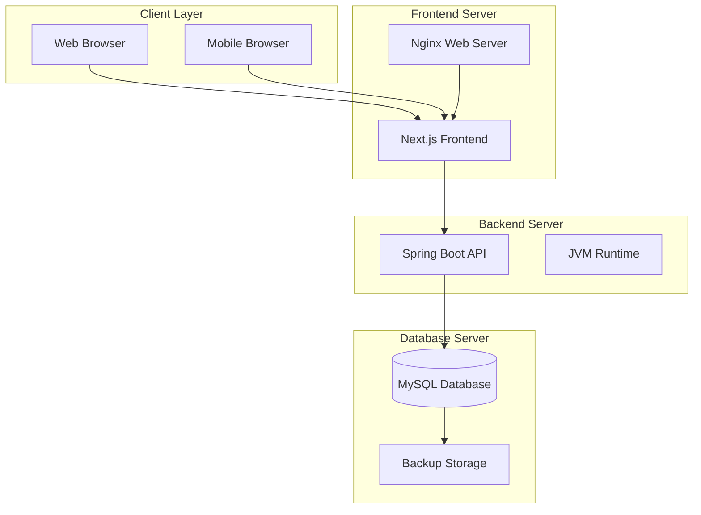

# System Overview

## System Architecture Summary

The SkillBridge platform is a monolithic web application designed for student learning purposes, supporting offshore IT project management between Japan and Vietnam.

### High-Level System Components

## System Components

### Frontend Server
- **Technology**: Next.js 14+ with TypeScript
- **Web Server**: Nginx
- **Purpose**: User interface and client-side logic
- **Port**: 3000 (development), 80/443 (production)

### Backend Server
- **Technology**: Spring Boot 3.x with Java 17+
- **Purpose**: Business logic and API services
- **Port**: 8080 (development), 80/443 (production)
- **Database**: MySQL 8.0+

### Database Server
- **Technology**: MySQL 8.0+
- **Purpose**: Data storage and persistence
- **Port**: 3306
- **Backup**: Daily automated backups

## System Requirements

### Hardware Requirements

#### Development Environment
- **CPU**: 4 cores minimum
- **RAM**: 8GB minimum
- **Storage**: 100GB SSD
- **Network**: Stable internet connection

#### Production Environment
- **Frontend Server**: 2 cores, 4GB RAM, 50GB SSD
- **Backend Server**: 4 cores, 8GB RAM, 100GB SSD
- **Database Server**: 2 cores, 4GB RAM, 200GB SSD

### Software Requirements

#### Development
- **Java**: 17+
- **Node.js**: 18+
- **MySQL**: 8.0+
- **Git**: Latest version
- **IDE**: VS Code or IntelliJ IDEA

#### Production
- **OS**: Ubuntu 20.04 LTS
- **Java**: 17+
- **Node.js**: 18+
- **MySQL**: 8.0+
- **Nginx**: Latest stable version

## System Dependencies

### External Dependencies
- **Email Service**: SMTP server for notifications
- **File Storage**: Local filesystem or cloud storage
- **SSL Certificate**: For HTTPS encryption
- **Domain Name**: For production deployment

### Internal Dependencies
- **Database**: MySQL for data persistence
- **Web Server**: Nginx for static file serving
- **Application Server**: Spring Boot embedded Tomcat
- **Frontend Build**: Next.js build process

## System Interfaces

### User Interfaces
- **Web Application**: Primary user interface
- **Mobile Browser**: Responsive web interface
- **Admin Panel**: System administration interface

### API Interfaces
- **REST API**: Backend API endpoints
- **Authentication**: JWT token-based authentication
- **File Upload**: Document management endpoints
- **WebSocket**: Real-time notifications (optional)

### Database Interfaces
- **JDBC**: Java database connectivity
- **Connection Pool**: HikariCP connection pooling
- **Transactions**: ACID compliance
- **Backup**: Automated backup procedures

## System Boundaries

### In Scope
- **User Management**: Authentication and authorization
- **Contact Management**: CRM functionality
- **Engineer Management**: Profile and skill management
- **Proposal Management**: Document creation and review
- **Contract Management**: MSA/SOW lifecycle
- **Document Management**: File storage and linking
- **Audit Logging**: Change tracking and compliance

### Out of Scope
- **Email Server**: External SMTP service
- **Payment Processing**: Third-party payment gateway
- **Video Conferencing**: External meeting platform
- **Advanced Analytics**: Business intelligence tools
- **Mobile App**: Native mobile applications

## System Constraints

### Performance Constraints
- **Response Time**: < 2 seconds for API calls
- **Concurrent Users**: Support up to 100 concurrent users
- **Database Queries**: Optimized for < 1 second response
- **File Upload**: Support files up to 10MB

### Security Constraints
- **Authentication**: JWT token-based authentication
- **Authorization**: Role-based access control
- **Data Encryption**: HTTPS for all communications
- **Input Validation**: Server-side validation for all inputs

### Operational Constraints
- **Uptime**: Target 99% uptime
- **Backup**: Daily automated backups
- **Monitoring**: Basic system monitoring
- **Maintenance**: Scheduled maintenance windows

## System Assumptions

### Technical Assumptions
- **Browser Support**: Modern browsers (Chrome, Firefox, Safari, Edge)
- **Network**: Stable internet connectivity
- **JavaScript**: Enabled in user browsers
- **Cookies**: Enabled for session management

### Business Assumptions
- **User Training**: Basic computer literacy
- **Data Volume**: Moderate data growth
- **Concurrent Usage**: Peak usage during business hours
- **Geographic Distribution**: Japan and Vietnam users

## System Risks

### Technical Risks
- **Database Failure**: Single point of failure
- **Server Downtime**: Service interruption
- **Data Loss**: Backup and recovery procedures
- **Security Breach**: Authentication and authorization

### Operational Risks
- **User Adoption**: Training and support requirements
- **Data Migration**: Legacy system integration
- **Performance**: System scalability limitations
- **Maintenance**: Ongoing system maintenance

## Success Criteria

### Functional Success
- **User Registration**: Successful user onboarding
- **Data Management**: Complete CRUD operations
- **Workflow Support**: End-to-end business processes
- **Integration**: Seamless system integration

### Non-Functional Success
- **Performance**: Response time < 2 seconds
- **Reliability**: 99% uptime target
- **Usability**: Intuitive user interface
- **Security**: Secure data handling

## System Evolution

### Short-term (3-6 months)
- **Basic Functionality**: Core features implementation
- **User Training**: System adoption
- **Performance Optimization**: System tuning
- **Bug Fixes**: Issue resolution

### Medium-term (6-12 months)
- **Feature Enhancement**: Additional functionality
- **Integration**: External system integration
- **Scalability**: Performance improvements
- **Security**: Enhanced security measures

### Long-term (12+ months)
- **Architecture Evolution**: System modernization
- **Advanced Features**: Business intelligence
- **Mobile Support**: Mobile application development
- **Cloud Migration**: Cloud infrastructure adoption
